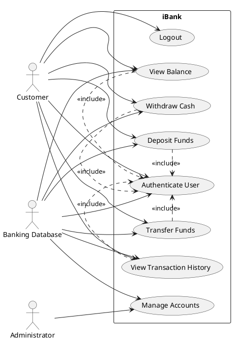

# Recommended iBank ABM Concept

A good choice for iBank is a **simplified Canadian retail banking ABM (ATM)** intended for everyday banking transactions by personal bank customers.

This concept is suitable for Canada because it reflects common Canadian ATM usage patterns while remaining legally and technically realistic for a student project. It can support:
- Account login using a simulated card number + PIN
- Cash withdrawal simulation
- Balance inquiry
- Deposit recording
- Funds transfer between a user’s own accounts
- Receipt generation/logging

The scope is small enough for a three-student team to implement in Java Swing or JavaFX, but still large enough for software measurement activities in later deliveries.

---

# Recommended Simple Scope for iBank

## Recommended Features
Keep the system intentionally limited to:
- Simulated card login
- PIN authentication
- Chequing and savings accounts
- Withdraw cash (simulation only)
- Deposit funds (record only)
- Balance inquiry
- Transfer between own accounts
- Transaction history
- Admin maintenance of sample users/accounts

## Features to Avoid
To reduce implementation risk and keep measurements manageable, avoid:
- Real bank integration
- Real debit/credit networks
- Real ATM hardware
- Physical card readers
- NFC/contactless payment
- Biometrics
- Cryptocurrency
- AI fraud detection
- Multi-bank interoperability
- Real cash inventory hardware
- Mobile banking integration
- Live interbank transfers

Instead, card reading should be simulated using:
- Manual card-number entry
or
- GUI selection from sample cards

---

# Suggested D1 Slide-by-Slide Outline

## Slide 1 — Title
- iBank Delivery 1
- Software Measurement Project
- Team members
- Course name

## Slide 2 — Project Overview
- What is iBank?
- Goal of the prototype
- Why a simplified ABM was selected

## Slide 3 — Selected ABM Type
- Canadian retail banking ABM
- Main functions
- Intended users

## Slide 4 — Scope and Assumptions
- Included features
- Excluded features
- Technical assumptions
- Legal assumptions

## Slide 5 — Canadian Context
- Accessibility considerations
- Privacy/security considerations
- Simulated banking environment

## Slide 6 — GQM Overview
- What is GQM?
- Why GQM is used
- Relationship between goal, questions, and metrics

## Slide 7 — SMART Goal
- Full GQM goal statement
- SMART analysis table

## Slide 8 — GQM Questions
- Six questions
- Why the questions matter

## Slide 9 — Metrics Overview
- Metrics per question
- Objective vs subjective metrics
- Data collection methods

## Slide 10 — Actors and Use Cases
- Actors list
- Core use cases

## Slide 11 — User Stories
- Example user stories
- Acceptance notes

## Slide 12 — Use Case Diagram
- UML diagram

## Slide 13 — Future Deliverables Fit
- Why implementation is manageable
- Measurement opportunities in D2/D3

## Slide 14 — GAI Usage and References
- How AI was used
- Verification requirements
- Reference categories

---

# Problem 1 — Selected ABM

## Selected ABM Type

A **simplified Canadian self-service retail banking ABM** for personal banking customers.

---

## Brief Description

iBank is a software-based ABM prototype that simulates common banking-machine operations used in Canadian banks. The system allows users to authenticate using a simulated card number and PIN, then perform basic account transactions through a graphical interface.

The system is educational and does not connect to real banking infrastructure.

---

## Primary Users

### Main Users
- Personal banking customers

### Secondary Users
- Bank administrator/maintenance staff
- System testers/developers

---

## Supported Transaction Categories

- User authentication
- Balance inquiry
- Cash withdrawal simulation
- Deposit recording
- Transfer between accounts owned by the same customer
- Receipt/transaction history viewing
- Session logout

---

## Canadian Context and Legal/Regulatory Assumptions

The project should assume compliance awareness with:
- Canadian privacy expectations for banking data
- Basic authentication/security practices
- Accessibility expectations for public systems

Possible sources to verify later:
- Office of the Superintendent of Financial Institutions (OSFI)
- Financial Consumer Agency of Canada (FCAC)
- Canadian accessibility standards
- PCI DSS concepts (only conceptually, not fully implemented)

### Important Limitation
This project is only a simulation and does not process real financial transactions.

---

## Explicit Project Assumptions

- No real ATM hardware exists
- Card insertion is simulated by GUI/manual input
- Currency handling is simulated
- Data is stored locally or in a lightweight database
- Single-bank environment only
- No networked interbank communication
- Only authenticated users may perform transactions
- Transactions are reversible only through admin/test reset
- Security is educational, not production-grade

---

# Problem 2 — GQM

# GQM Goal

## Goal Statement

### Purpose
To **evaluate** the iBank ABM prototype in order to **improve** its usability, maintainability, and reliability.

### Perspective
Examine **transaction efficiency and software quality** from the viewpoint of:
- student developers,
- course evaluators,
- and prototype users.

### Environment
In the context of a **Java-based educational banking-machine simulation developed by a three-student team during the Software Measurement course**.

---

# SMART Check Table

| SMART Element | Evidence in Goal | Possible Weakness |
|---|---|---|
| Specific | Focuses on usability, maintainability, and reliability of iBank | Quality attributes are still somewhat broad |
| Measurable | Metrics can measure complexity, errors, and transaction completion | Some usability aspects may need subjective feedback |
| Attainable | Scope is small and feasible for 3 students | Time management still required |
| Realistic | Uses simulated banking features only | Real banking conditions are not represented |
| Timely | Measured during course deliveries | Exact measurement schedule should be defined |

---

# Exactly 6 GQM Questions

## Q1
How efficiently can users complete common banking transactions?

## Q2
How reliable is the transaction-processing functionality during normal usage?

## Q3
How maintainable is the Java codebase for future modifications?

## Q4
How understandable and usable is the interface for first-time users?

## Q5
How complex are the core transaction-processing components?

## Q6
How accurately does the prototype implement its defined use cases?

---

# Metrics for Each Question

## Q1 — Transaction Efficiency

| Item | Details |
|---|---|
| Candidate Metrics | Average task completion time, number of clicks/screens |
| Type | Objective |
| Entity | User transaction flow |
| Attribute | Efficiency |
| Unit/Scale | Seconds, count |
| Collection Method | User testing/session logging |
| Why Useful | Faster and shorter flows suggest better usability |

### Note
Efficiency alone does not guarantee user satisfaction.

---

## Q2 — Reliability

| Item | Details |
|---|---|
| Candidate Metrics | Failed transaction count, successful transaction rate |
| Type | Objective |
| Entity | Transaction subsystem |
| Attribute | Reliability |
| Unit/Scale | Percentage, count |
| Collection Method | Test execution logs |
| Why Useful | Indicates whether functions operate consistently |

---

## Q3 — Maintainability

| Item | Details |
|---|---|
| Candidate Metrics | WMC, LCOM*, coupling factor (CF), comment density |
| Type | Objective |
| Entity | Source code |
| Attribute | Maintainability |
| Unit/Scale | Numerical metrics |
| Collection Method | Static code analysis |
| Why Useful | Helps estimate modification difficulty |

### Important Observation
Maintainability cannot be judged perfectly from metrics alone because developer experience and code readability also matter.

---

## Q4 — Interface Usability

| Item | Details |
|---|---|
| Candidate Metrics | User satisfaction rating, task error count |
| Type | Mixed (subjective + objective) |
| Entity | GUI interface |
| Attribute | Usability |
| Unit/Scale | Likert scale, count |
| Collection Method | User survey + observation |
| Why Useful | Combines measurable behavior with human perception |

### Important Observation
This question cannot be answered well using only metrics because usability depends heavily on user perception and context.

---

## Q5 — Component Complexity

| Item | Details |
|---|---|
| Candidate Metrics | Cyclomatic complexity, logical SLOC |
| Type | Objective |
| Entity | Transaction-processing classes |
| Attribute | Complexity |
| Unit/Scale | Numerical metrics |
| Collection Method | Static analysis tools |
| Why Useful | High complexity may increase testing and maintenance difficulty |

---

## Q6 — Use Case Coverage

| Item | Details |
|---|---|
| Candidate Metrics | Percentage of implemented use cases, passed acceptance tests |
| Type | Objective |
| Entity | Functional requirements |
| Attribute | Functional completeness |
| Unit/Scale | Percentage |
| Collection Method | Requirement traceability matrix and testing |
| Why Useful | Indicates whether the prototype satisfies intended behavior |

---

# Metric / Measure / Indicator Clarification

## Example

### Measure
- A withdrawal takes 42 seconds.

### Metric
- Average withdrawal completion time across 20 tests.

### Indicator
- “Transaction efficiency is acceptable because average completion time is below the target threshold.”

This distinction is important because raw measures alone do not provide interpretation.

---

# Problem 3 — Use Case Model

# Actor Definitions

| Actor | Definition |
|---|---|
| Customer | Bank client using the ABM for transactions |
| Administrator | Maintains user/account data and resets test information |
| Banking Database | Simulated storage system containing account and transaction data |

---

# Use Case Definitions

| Use Case | Purpose |
|---|---|
| Authenticate User | Validate card number and PIN |
| View Balance | Display account balance |
| Withdraw Cash | Simulate cash withdrawal |
| Deposit Funds | Record a deposit |
| Transfer Funds | Transfer between user-owned accounts |
| View Transaction History | Show recent transactions |
| Logout | End current session |
| Manage Accounts | Admin maintenance operations |

---

# User-Story-First Table

| Use Case | User Story | Acceptance Notes for Prototype |
|---|---|---|
| Authenticate User | As a customer, I want to log in securely so that I can access my accounts. | Correct PIN grants access; invalid PIN rejected |
| View Balance | As a customer, I want to see my account balance so that I know available funds. | Current balance displayed correctly |
| Withdraw Cash | As a customer, I want to withdraw money so that I can simulate obtaining cash. | Balance decreases if funds sufficient |
| Deposit Funds | As a customer, I want to deposit funds so that my balance increases. | Deposit updates balance |
| Transfer Funds | As a customer, I want to move money between my accounts so that I can manage funds. | Transfer updates both accounts |
| View Transaction History | As a customer, I want to review previous transactions so that I can track activity. | Recent transaction list shown |
| Logout | As a customer, I want to end my session so that my information remains secure. | Session data cleared |
| Manage Accounts | As an administrator, I want to manage sample users/accounts so that the prototype remains testable. | Admin can add/edit/reset sample data |

---

# Textual Use Case Model

| Use Case | Primary Actor | Supporting Actor | Preconditions | Main Success Scenario | Exceptions | Postconditions |
|---|---|---|---|---|---|---|
| Authenticate User | Customer | Banking Database | User has sample card number | Enter card + PIN → validation succeeds | Invalid credentials | Session started |
| View Balance | Customer | Banking Database | Authenticated session exists | Select account → system displays balance | Session timeout | Balance displayed |
| Withdraw Cash | Customer | Banking Database | Authenticated + sufficient funds | Enter amount → confirm withdrawal | Insufficient funds | Balance updated |
| Deposit Funds | Customer | Banking Database | Authenticated session exists | Enter deposit amount | Invalid amount | Balance updated |
| Transfer Funds | Customer | Banking Database | Two valid accounts exist | Select source/destination → transfer | Insufficient funds | Both balances updated |
| View Transaction History | Customer | Banking Database | Authenticated session exists | Request history | No transactions found | History displayed |
| Logout | Customer | None | Active session exists | User logs out | Session already expired | Session terminated |
| Manage Accounts | Administrator | Banking Database | Admin authenticated | Create/edit/reset data | Invalid input | Data updated |

---

# Graphical Use Case Diagram (PlantUML)

---

# Relationship Notes

## Include Relationships
Most customer transactions include:
- Authenticate User

Reason:
- Authentication is mandatory before protected operations.

## Extend Relationships
Not necessary for the simplified prototype.

## Generalization
Not necessary because actor hierarchy is intentionally simple.

---

# Future Deliverables Fit

## Why the Scope Fits a Three-Student Team

The project is manageable because:
- GUI requirements are moderate
- Database needs are simple
- No real hardware integration exists
- No external banking APIs are required
- Features are limited to core ATM operations

Java Swing or JavaFX is sufficient for implementation.

---

## Possible Future Classes (No Code)

### Core Classes
- User
- Account
- Transaction
- ATMController
- AuthenticationService
- TransactionService

### GUI Classes
- LoginScreen
- MainMenuScreen
- WithdrawScreen
- DepositScreen
- TransferScreen

### Data Classes
- DatabaseManager
- TransactionLogger

---

## Why the Scope Supports D3 Measurements

The project is large enough to support:
- Logical SLOC
- Cyclomatic complexity
- WMC
- Coupling factor (CF)
- LCOM*
- Use Case Points (UCP)
- Correlation analysis

But still small enough to:
- Understand manually
- Test completely
- Measure consistently
- Avoid excessive class explosion

The separation of GUI, business logic, and data handling should naturally create measurable variation between classes.

---

# GAI Use Explanation

## Purpose of This Prompt

The prompt was intended to:
- Generate an initial D1 structure
- Apply GQM concepts correctly
- Produce measurable and traceable requirements
- Create a manageable project scope
- Connect requirements to future software metrics

---

## Required Human Review

The team should:
- Simplify wording for presentation slides
- Verify Canadian references
- Adjust assumptions to match instructor expectations
- Validate UML formatting
- Ensure metrics align with course lectures

AI output should be treated as a draft, not authoritative truth.

---

## What Requires External Verification

The team should verify:
- Canadian banking/privacy guidance
- Accessibility obligations
- Security terminology
- GQM definitions from academic literature
- UML/use-case notation standards
- Any cited frameworks or standards

---

# Potential References To Verify

## Canadian Banking and Regulation
- Office of the Superintendent of Financial Institutions (OSFI)
- Financial Consumer Agency of Canada (FCAC)
- Payments Canada

## Accessibility
- Accessible Canada Act
- WCAG accessibility guidance

## Security Guidance
- PCI DSS documentation
- ATM security best practices
- Authentication and PIN-handling guidance

## GQM and Software Measurement
- Basili’s Goal-Question-Metric methodology
- Software engineering measurement textbooks
- ISO/IEC software quality references

## UML and Use Cases
- UML specification references
- Use-case modeling literature
- User-story agile references

