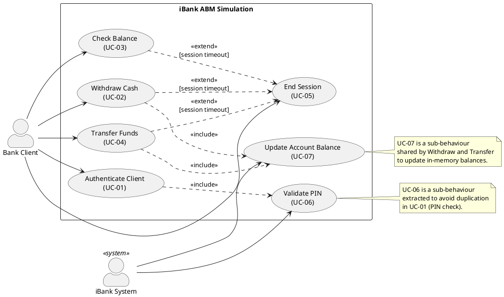

# iBank — Delivery 1
## Software Measurement Project | Team Size N = 3

> **GAI Disclosure:** This document was produced with the assistance of a large-language-model-based tool under explicit prompting constraints. All content must be reviewed, verified, and revised by team members before submission. Claims referencing regulations, standards, or literature must be independently confirmed against primary sources. Original wording has been used throughout; no external text has been reproduced verbatim.

---

## Recommended ABM Concept for iBank

**Concept:** A simulated, software-only Automated Banking Machine (ABM) implemented as a Java desktop GUI application.

**Why it fits Canada:**
- Standard retail ABMs are deployed nationwide by chartered banks and credit unions under frameworks overseen by the Financial Consumer Agency of Canada (FCAC) and the federal *Bank Act* (S.C. 1991, c. 46). A simulated, non-networked ABM avoids regulated payment-network requirements while remaining legally and conceptually representative.
- Canadian accessibility expectations (derived in part from the *Accessible Canada Act*, S.C. 2019, c. 10) mean the interface design should consider accessible UI patterns — feasible in Java Swing/JavaFX.
- Interac-style PIN entry and card-number simulation (via GUI text field or dropdown) reflect common Canadian ABM UX without requiring hardware or live network integration.

**Deliberately Simple Scope (what iBank does NOT include):**
- No real magnetic-stripe, chip, EMV, or NFC card-reader hardware.
- No live connection to any payment network (Interac, Visa, Mastercard, etc.).
- No biometric authentication.
- No cryptocurrency or foreign-exchange transactions.
- No live interbank or wire transfers.
- No fraud-scoring engine.
- No hardware-level cash dispenser management.
- Card selection is simulated by typing or selecting a sample card number from a pre-loaded set in the GUI.

---

## Slide-by-Slide Outline for Delivery 1

| Slide # | Title | Key Bullet Points |
|---------|-------|-------------------|
| 1 | Title Slide | Project name: iBank; Team members; Course; Date |
| 2 | Team & Process Overview | N = 3; Agile + DevOps context; GAI tool(s) used; CASTROFF prompt method |
| 3 | Problem 1 — ABM Selection | Selected ABM type; Brief description; Primary users |
| 4 | Problem 1 — Scope & Assumptions | Supported transactions; Canadian context; Regulatory assumptions; Project assumptions |
| 5 | Problem 2 — GQM Goal | Full goal statement; SMART check table |
| 6 | Problem 2 — Questions & Metrics (Q1–Q3) | First three questions; candidate metrics; entities and attributes |
| 7 | Problem 2 — Questions & Metrics (Q4–Q6) | Remaining three questions; candidate metrics; discussion |
| 8 | Problem 2 — Metrics Discussion | Metric vs. measure vs. indicator; which questions resist metric-only answers; context dependency |
| 9 | Problem 3 — Actors & User Stories | Actor definitions; user-story-first table |
| 10 | Problem 3 — Use Case Model (Textual) | UC table: preconditions, main scenario, exceptions, postconditions |
| 11 | Problem 3 — Use Case Diagram | PlantUML/Mermaid graphical model; relationship notes |
| 12 | Future Deliverables Fit | Java class sketch; D2 implementability; D3 metric applicability |
| 13 | GAI Use Explanation | Prompt intent; review checklist; parts needing citation |
| 14 | References | Verified sources |

---

## Problem 1 — ABM Selection and Description

### Selected ABM Type
A **standard retail cash-and-account ABM** — the most common type found in Canadian bank branches, grocery stores, and convenience locations, supporting cash withdrawal, balance inquiry, and fund transfers between a single client's own accounts.

### Brief Description
iBank simulates the core customer-facing software layer of a retail ABM. A session begins when a client selects (or types) their card number from a pre-loaded sample set, enters a PIN, and then chooses from a menu of transactions. The application maintains a simple in-memory account model and logs session events. No network calls are made. The simulation ends when the client chooses to exit or a session timeout is reached.

### Primary Users
- **Bank Client:** a registered individual who holds one or more accounts at the simulated bank and interacts with the ABM to perform financial self-service.
- **Bank Operator (out-of-scope for runtime, but relevant to setup):** a technical staff member who configures sample accounts and restarts the application if needed; not modelled as an interactive runtime actor in this scope.

### Supported Transaction Categories

| Category | Example Transactions |
|----------|----------------------|
| Cash Withdrawal | Withdraw from chequing or savings |
| Balance Inquiry | View current balance for any owned account |
| Fund Transfer | Move funds between the client's own chequing and savings accounts |
| PIN Management | Change PIN (optional stretch feature) |

### Canadian Context and Legal/Regulatory Assumptions
- The ABM concept is consistent with the type of machine governed by the FCAC under the *Bank Act*. *(Assumption: the team should verify current FCAC guidance on ABM disclosure requirements; exact regulatory text is not reproduced here.)*
- Accessibility: the GUI should follow reasonable accessible-design principles in acknowledgment of obligations under the *Accessible Canada Act* and the WCAG-inspired standards that may apply to digital interfaces. *(Assumption: full accessibility compliance is a design goal, not a graded deliverable requirement for D1.)*
- No financial data is transmitted or stored permanently; therefore privacy regulations such as PIPEDA (S.C. 2000, c. 5) do not apply at runtime to this simulation. *(Assumption: if the team later adds persistent storage, this assumption must be revisited.)*
- Interac is Canada's primary domestic debit network; iBank does not connect to it but models its session flow conceptually. *(Assumption: no Interac trademark or branding is used in the application.)*

### Explicit Project Assumptions
1. Card reading is simulated by manual entry or GUI dropdown selection of a pre-defined card number; no physical card-reader hardware exists.
2. The "bank" has exactly two account types per client: chequing and savings.
3. Account balances are initialized at application start from a hard-coded or file-based configuration; no database is used for D1/D2.
4. All monetary amounts are in Canadian dollars (CAD); no currency conversion is implemented.
5. The maximum number of sample clients is small (e.g., 3–5) to keep the model tractable.
6. Session timeout after a fixed inactivity period (e.g., 30 seconds) is implemented as a simple timer, not a hardware signal.
7. The application is single-user, single-session; concurrent access is out of scope.
8. Security mechanisms are simulated (PIN comparison against a stored value) and are not cryptographically hardened.
9. Receipt printing is simulated by displaying a transaction summary on screen; no physical printer is modelled.
10. The application will be implemented in Java (Swing or JavaFX) and run on a standard desktop JVM without external dependencies beyond the Java SE standard library.

---

## Problem 2 — GQM Goal, Questions, and Metrics

### GQM Goal Statement

**Purpose:** To *evaluate* the *iBank ABM simulation* in order to *improve* it.
**Perspective:** Examine *transaction reliability and usability* from the viewpoint of *the development team*.
**Environment:** In the context of *a three-student, one-semester Java GUI project following an agile and DevOps process*.

**Full goal (combined form):**
Evaluate the transaction reliability and usability of the iBank ABM simulation, in order to improve it, from the viewpoint of the development team, in the context of a three-student, one-semester Java GUI project following an agile and DevOps process.

---

### SMART Check Table

| SMART Element | Evidence in the Goal | Possible Weakness |
|---------------|----------------------|-------------------|
| **Specific** | Targets transaction reliability and usability of a named system (iBank), for a named stakeholder (development team) | "Reliability" and "usability" each contain multiple sub-attributes; further decomposition is needed at the question level |
| **Measurable** | Both reliability (e.g., transaction success rate) and usability (e.g., task completion time) map to quantifiable or categorizable metrics | Some usability metrics require user testing, which may not be feasible in a simulation context |
| **Attainable** | The scope is deliberately restricted to a Java GUI simulation; the team can instrument and test it within a semester | Attainability of user-study metrics depends on access to willing participants |
| **Realistic** | The system is small enough (few classes, few use cases) that full coverage measurement is practical | If scope expands beyond the stated assumptions, the goal may need revision |
| **Timely** | Framed within "a one-semester project"; D3 is the explicit measurement deadline | The goal statement does not specify a calendar date; the team should add one (e.g., "by the D3 submission date") |

---

### Questions and Metrics (2N = 6 Questions for N = 3)

---

#### Q1 — How reliably does iBank complete a valid cash-withdrawal transaction without error?

| Field | Detail |
|-------|--------|
| **Candidate Metric** | Transaction Success Rate (TSR) = (number of withdrawal transactions completed without exception) / (total withdrawal transactions attempted) × 100% |
| **Objective / Subjective** | Objective |
| **Entity** | iBank software system |
| **Attribute** | Reliability of the withdrawal use case |
| **Unit / Scale** | Percentage (0–100%) |
| **Collection Method** | Execute a defined test suite of withdrawal transactions (valid and boundary inputs); count successes and failures from console/log output or test-framework assertions |
| **Why It Helps** | A TSR below an agreed threshold (e.g., 95%) directly signals that the withdrawal use case needs correction before D3 evaluation; gives the team an actionable pass/fail indicator |

---

#### Q2 — How complex is the iBank codebase relative to its size?

| Field | Detail |
|-------|--------|
| **Candidate Metrics** | (a) Cyclomatic Complexity (CC) per method; (b) Weighted Methods per Class (WMC) per class; (c) Logical SLOC |
| **Objective / Subjective** | Objective (all three are tool-countable) |
| **Entity** | iBank source-code modules |
| **Attribute** | Structural complexity |
| **Unit / Scale** | CC: integer count per method; WMC: sum of CC values per class; SLOC: integer line count (logical, excluding blanks and comments) |
| **Collection Method** | Static analysis tools (e.g., PMD, Checkstyle, or a custom script) run on the Java source tree |
| **Why It Helps** | High WMC or CC without corresponding size may indicate design problems; combining CC with SLOC prevents misinterpretation (a single large method looks different when SLOC is also reported) |

> **Note:** A single metric (e.g., CC alone) is insufficient for judgment. The team must report CC, WMC, and SLOC together and interpret the combination. This is an example of why a single measure without context is not enough for interpretation (a core course concept).

---

#### Q3 — How well are the iBank classes cohesive in their responsibilities?

| Field | Detail |
|-------|--------|
| **Candidate Metric** | LCOM* (Lack of Cohesion of Methods, normalized variant) per class |
| **Objective / Subjective** | Objective |
| **Entity** | iBank Java classes |
| **Attribute** | Cohesion |
| **Unit / Scale** | LCOM* ∈ [0, 1]; values closer to 1 indicate lower cohesion |
| **Collection Method** | Static analysis tool capable of computing LCOM* (e.g., CK metrics tool, or a research tool such as the one described by Chidamber & Kemerer 1994 — *verify citation*) |
| **Why It Helps** | A high LCOM* for a class such as `Account` or `Session` suggests it may be doing too much and should be refactored before D3 |

---

#### Q4 — How many use-case-driven functional points does iBank represent?

| Field | Detail |
|-------|--------|
| **Candidate Metric** | Use Case Points (UCP), derived from actor and use case weights and complexity adjustments |
| **Objective / Subjective** | Primarily objective, but use-case complexity classification (simple/average/complex) introduces a subjective element |
| **Entity** | iBank use-case model |
| **Attribute** | Functional size |
| **Unit / Scale** | UCP (dimensionless integer-like score) |
| **Collection Method** | Manual calculation from the use-case diagram and textual descriptions using the Karner (1993) UCP method — *verify citation* |
| **Why It Helps** | UCP provides a size baseline for effort estimation and correlation analysis in D3; it bridges the requirements model and the code-level metrics |

> **Note on subjectivity:** The team must document and justify complexity classifications consistently; otherwise the metric loses reproducibility. This is a case where the metric partially resists purely objective collection.

---

#### Q5 — How effectively can a first-time user complete a balance-inquiry transaction without external help?

| Field | Detail |
|-------|--------|
| **Candidate Metrics** | (a) Task Completion Rate for balance inquiry (pass/fail per participant); (b) Time-on-Task (seconds from session start to displayed balance) |
| **Objective / Subjective** | (a) Objective with a defined success criterion; (b) Objective (clock-measured) |
| **Entity** | iBank GUI + test participant interaction |
| **Attribute** | Learnability / ease-of-use |
| **Unit / Scale** | (a) Proportion (0–1); (b) Seconds |
| **Collection Method** | Informal think-aloud or task-scenario session with 1–3 volunteer participants who have not previously seen iBank; observer records completion and elapsed time |
| **Why It Helps** | Even a small informal test provides qualitative insight that code metrics alone cannot supply; the combination of completion rate and time-on-task is a standard minimal usability measure |

> **Important limitation:** This question cannot be answered fully by code metrics alone. It requires at least a minimal user observation. The team should acknowledge that a sample of 1–3 participants has very limited statistical validity; findings are indicative only and must be labeled as such.

---

#### Q6 — Is there a correlation between structural complexity and the number of defects found per class during testing?

| Field | Detail |
|-------|--------|
| **Candidate Metrics** | (a) WMC or CC per class (independent variable); (b) Defect count per class from test records (dependent variable); (c) Spearman or Pearson correlation coefficient |
| **Objective / Subjective** | Objective (both variable sides are countable) |
| **Entity** | iBank Java classes |
| **Attribute** | Relationship between complexity and defect density |
| **Unit / Scale** | Correlation coefficient r ∈ [−1, 1] |
| **Collection Method** | Maintain a defect log during unit testing (e.g., via GitHub Issues or a simple spreadsheet) keyed to class names; pair with static-analysis complexity output; compute correlation in a spreadsheet or Python/R script |
| **Why It Helps** | Directly supports the D3 correlation analysis requirement; validates (or questions) the common hypothesis that higher complexity correlates with higher defect counts in this specific project |

> **Caveat:** With only a small number of classes (perhaps 8–15), the correlation result will have low statistical power. The team must state this limitation explicitly in D3 and treat any correlation found as a preliminary observation, not a generalizable finding.

---

### Metrics Discussion: Key Course Concepts Applied

**Metric vs. Measure vs. Indicator:**
- A *measure* is the raw count or value obtained (e.g., "this method has 7 branches").
- A *metric* assigns that value to an attribute of an entity according to a defined rule (e.g., "the cyclomatic complexity of method `processWithdrawal` is 7").
- An *indicator* combines one or more metrics with a threshold or trend to support a decision (e.g., "methods with CC > 10 are flagged for review").

**Questions that resist metric-only answers:**
- Q5 (usability/learnability) cannot be answered by code metrics; it requires human-interaction data. Even with task completion and time-on-task measurements, interpretation requires qualitative judgment.
- Q6 requires sufficient data points; with a small class count, statistical validity is limited, and the correlation coefficient alone is not a sufficient basis for judgment.

**Metric misuse warning:** No single metric from this set should be used in isolation to judge the overall quality of iBank. The team should report all relevant metrics together and contextualize each finding within the project's scope and constraints.

---

## Problem 3 — Use Case Model

### Actor Definitions

| Actor | Type | Description |
|-------|------|-------------|
| **Bank Client** | Primary actor (human) | An individual who holds one or more accounts at the simulated bank. The Client initiates all runtime ABM interactions. In iBank, the Client is represented by a GUI user who selects a card number and enters a PIN. |
| **iBank System** | Supporting actor (system) | The internal ABM software itself. It validates credentials, enforces business rules (e.g., insufficient funds), updates account balances in memory, and generates session receipts. It plays a supporting role in use cases that require system-side validation. |

> **Scope note:** A "Bank Operator" exists conceptually (for configuration and maintenance) but is not modelled as a runtime actor in this scope, consistent with the stated project assumptions. Adding an operator actor in D2 is straightforward if desired.

---

### User-Story-First Table

| Use Case ID | Use Case Name | User Story | Acceptance Notes for Prototype |
|-------------|---------------|------------|-------------------------------|
| UC-01 | Authenticate Client | As a Bank Client, I want to select my card and enter my PIN so that I can access my accounts securely. | Card is selected from a GUI dropdown or typed into a text field. A correct PIN unlocks the main menu. Three consecutive wrong PINs lock the session. |
| UC-02 | Withdraw Cash | As a Bank Client, I want to withdraw a specified amount from my chequing or savings account so that I can obtain cash. | Amount must be a positive multiple of 20 (CAD). System refuses if balance is insufficient. Balance is updated in memory and a simulated receipt is shown. |
| UC-03 | Check Balance | As a Bank Client, I want to view the current balance of any of my accounts so that I can monitor my finances. | Both chequing and savings balances are displayed after successful authentication. No modification to account state occurs. |
| UC-04 | Transfer Funds | As a Bank Client, I want to move a specified amount from one of my accounts to another so that I can manage my funds. | Only transfers between the same client's own accounts are permitted. Insufficient-balance condition is handled with an error message. |
| UC-05 | End Session | As a Bank Client, I want to end my ABM session so that my account is protected after I am done. | Client chooses "Exit" or session timer expires. The system resets to the initial card-selection screen. No account state persists after the session in memory beyond the current application run. |

---

### Textual Use Case Model

#### UC-01 — Authenticate Client

| Field | Detail |
|-------|--------|
| **Primary Actor** | Bank Client |
| **Supporting Actor** | iBank System |
| **Preconditions** | Application is running; initial card-selection screen is displayed. |
| **Main Success Scenario** | 1. Client selects (or types) their card number. 2. System prompts for PIN. 3. Client enters PIN. 4. System validates PIN against stored value. 5. System displays main transaction menu. |
| **Exceptions** | E1: PIN is incorrect — system displays error and increments attempt counter. After three failed attempts, the system displays a lockout message and resets to the card-selection screen. E2: No card number selected — system prompts again. |
| **Postconditions** | Client is authenticated and the main menu is visible. |

---

#### UC-02 — Withdraw Cash

| Field | Detail |
|-------|--------|
| **Primary Actor** | Bank Client |
| **Supporting Actor** | iBank System |
| **Preconditions** | UC-01 has been completed successfully. |
| **Main Success Scenario** | 1. Client selects "Withdraw" from the menu. 2. Client selects account type (chequing or savings). 3. Client enters desired withdrawal amount. 4. System verifies amount is a positive multiple of 20 and does not exceed the account balance. 5. System deducts the amount from the account in memory. 6. System displays a simulated receipt with the amount withdrawn and the updated balance. |
| **Exceptions** | E1: Amount is not a multiple of 20 — system displays an error and requests re-entry. E2: Amount exceeds balance — system displays an insufficient-funds message and returns to the menu. E3: Client cancels — system returns to main menu without modifying the balance. |
| **Postconditions** | Account balance is reduced by the withdrawn amount (in memory). A transaction summary is displayed. |

---

#### UC-03 — Check Balance

| Field | Detail |
|-------|--------|
| **Primary Actor** | Bank Client |
| **Supporting Actor** | iBank System |
| **Preconditions** | UC-01 has been completed successfully. |
| **Main Success Scenario** | 1. Client selects "Balance Inquiry" from the menu. 2. System retrieves and displays the current balance of both the chequing and savings accounts. |
| **Exceptions** | E1: No accounts found for the client — system displays an error (should not occur if sample data is correctly initialized). |
| **Postconditions** | No account state is changed. Client has seen the current balances. |

---

#### UC-04 — Transfer Funds

| Field | Detail |
|-------|--------|
| **Primary Actor** | Bank Client |
| **Supporting Actor** | iBank System |
| **Preconditions** | UC-01 has been completed successfully. The client has at least two accounts (chequing and savings). |
| **Main Success Scenario** | 1. Client selects "Transfer" from the menu. 2. Client selects the source account. 3. Client selects the destination account. 4. Client enters the transfer amount. 5. System verifies the source account has sufficient funds. 6. System deducts the amount from the source and adds it to the destination in memory. 7. System displays a transfer summary. |
| **Exceptions** | E1: Source and destination are the same — system displays an error and returns to the transfer screen. E2: Insufficient funds in source account — system displays an error message. E3: Client cancels — system returns to main menu without modification. |
| **Postconditions** | Source account balance is reduced; destination account balance is increased by the same amount (in memory). |

---

#### UC-05 — End Session

| Field | Detail |
|-------|--------|
| **Primary Actor** | Bank Client |
| **Supporting Actor** | iBank System |
| **Preconditions** | A session is active (UC-01 completed). |
| **Main Success Scenario** | 1. Client selects "Exit" OR the session timer expires. 2. System displays a farewell message. 3. System clears session state and returns to the initial card-selection screen. |
| **Exceptions** | None significant beyond the timer-triggered path, which is handled as a normal scenario variant. |
| **Postconditions** | No client is authenticated. The application is ready for the next client. |

---

### Graphical Use Case Diagram (PlantUML Syntax)

Copy the block below into any PlantUML renderer (e.g., plantuml.com, IntelliJ PlantUML plugin, or VS Code PlantUML extension) to generate the diagram.

---

### Relationship Notes

**Include relationships:**
- UC-01 *includes* UC-06 (Validate PIN): every authentication attempt necessarily involves a PIN validation step. Extracting this avoids duplicating the validation logic in the textual model. In Java, this corresponds to a method call that will increase testability.
- UC-02 and UC-04 both *include* UC-07 (Update Account Balance): both withdrawal and transfer ultimately modify account balances by the same mechanism. Sharing this sub-behavior reflects the DRY (Don't Repeat Yourself) principle and will be realized as a single method in D2.

**Extend relationships:**
- UC-02, UC-03, and UC-04 may all *extend* UC-05 under the condition "session timeout." This captures the session-timer mechanism without bloating the main success scenarios of the three transaction use cases.

**No generalization relationships** are needed in this scope; both actors are distinct enough that actor inheritance is not warranted.

---

## Future Deliverables Fit

### Why the Scope is Implementable by Three Students in Java Swing/JavaFX

The iBank scope contains five primary use cases, two actors, and two account types. This translates to a Java application with roughly 8–15 classes depending on design choices — comfortably within what three students can design, implement, and test in a single semester. Java Swing is part of the standard Java SE library, so no additional build dependencies are needed.

### Candidate Classes for D2 (No Code Written Here)

| Candidate Class | Responsibility |
|----------------|---------------|
| `Card` | Holds card number and links to a client |
| `Client` | Holds client identity and owns one or more accounts |
| `Account` | Abstract or base class for account types; holds balance |
| `ChequingAccount` | Extends or implements `Account`; chequing-specific rules |
| `SavingsAccount` | Extends or implements `Account`; savings-specific rules |
| `Session` | Manages authentication state, attempt counter, and timer |
| `Transaction` | Records a single transaction event (type, amount, timestamp) |
| `ABMController` | Orchestrates use-case logic; bridges GUI and model |
| `ABMFrame` | Main Swing/JavaFX window; handles UI events |
| `AccountDataLoader` | Loads sample account data from config or hard-coded values |

> Note: This is an initial sketch. The actual class design will emerge during D2 and may differ. A `Receipt` or `TransactionLog` class could also be valuable for testability.

### Why the Scope Supports D3 Metrics

| D3 Metric | Why iBank Supports It |
|-----------|----------------------|
| Logical SLOC | The ~10-class model will produce measurable but not overwhelming SLOC; trends within classes are meaningful |
| Cyclomatic Complexity | Methods like `processWithdrawal` and `validatePIN` have branches sufficient for non-trivial CC values |
| WMC | Classes such as `ABMController` are expected to have higher WMC than simple data classes, enabling comparison |
| CF (Coupling Factor) | With explicit relationships (e.g., `Session` references `Client`, which references `Account`), CF will be non-trivial |
| LCOM* | Classes with mixed responsibilities (if any) will show measurable lack of cohesion; good-design classes will show low LCOM* |
| UCP | The five use cases with two actors and defined complexities make UCP calculation straightforward |
| Correlation Analysis | WMC/CC vs. defect counts across ~10 classes provides a small but analyzable dataset; the team must document limitations of small-N correlation |

The scope is intentionally sized so that no single metric dominates trivially. A system with only 2–3 classes would produce uninformative metrics; a system with 50+ classes would be unmanageable for a three-student team.

---

## GAI Use Explanation

### What This Prompt Was Intended to Obtain
The prompt was designed to produce a complete structured scaffold for Delivery 1, covering all three problems, in a format suitable for conversion to slides. The CASTROFF framework (Constraints, Audience, Structure, Tone, Role, Output format, Focus, Function) was applied to make the prompt precise and reduce irrelevant output. The intent was to use GAI as a drafting and structuring aid, not as a source of ground truth.

### How the Output Should Be Reviewed and Modified Before Submission
- Every claim about Canadian law or regulation must be verified against the primary source (e.g., the *Bank Act*, FCAC website, *Accessible Canada Act*).
- The GQM goal and questions should be discussed as a team and revised to reflect the team's actual project decisions.
- The use case diagram should be rendered and reviewed; team members should confirm it accurately reflects their intended scope.
- Metric definitions (especially LCOM*, UCP) should be traced to the specific formulas the team will use in D3, and the sources for those formulas must be cited.
- Team-specific details (names, submission date, course code, professor name) must be filled in.
- The "Candidate Classes" section is speculative; adjust after D2 design begins.

### Parts Requiring External Citation or Verification
- GQM methodology: cite Basili, Caldiera & Rombach (1994) or the original Basili & Weiss (1984) paper — *verify availability*.
- LCOM* definition: cite Chidamber & Kemerer (1994) — *verify the exact formula used*.
- UCP: cite Karner (1993) — *note this is a technical report and may be harder to locate; the team should also consult secondary sources such as Anda, Dreiem & Sjøberg (2005) or similar peer-reviewed treatments of UCP — verify citations*.
- Canadian banking regulation: cite the *Bank Act* (S.C. 1991, c. 46) and the FCAC website directly.
- Accessibility: cite the *Accessible Canada Act* (S.C. 2019, c. 10) and the relevant CAN/CSA or W3C WCAG standard — *verify which version applies*.

---

## Potential References to Verify

The following categories of sources are likely relevant. **Do not treat these as complete citations.** Each must be located and verified before inclusion in the submission.

| Category | What to Look For |
|----------|-----------------|
| Canadian Banking Regulation | *Bank Act*, S.C. 1991, c. 46 (current consolidated version on Justice Laws website); FCAC ABM guidelines |
| Canadian Accessibility Standards | *Accessible Canada Act*, S.C. 2019, c. 10; Accessibility Standards Canada guidance; WCAG 2.1 (W3C) |
| ATM Security Guidance | Interac Association technical guidelines (if publicly available); CPA Canada guidance on ABM security |
| GQM Methodology | Basili, V.R., & Weiss, D.M. (1984). "A methodology for collecting valid software engineering data." *IEEE Transactions on Software Engineering.* — *verify volume/issue*; Basili, V.R., Caldiera, G., & Rombach, H.D. (1994). "The Goal Question Metric approach." In *Encyclopedia of Software Engineering*. Wiley. — *verify details* |
| Object-Oriented Metrics | Chidamber, S.R., & Kemerer, C.F. (1994). "A metrics suite for object oriented design." *IEEE Transactions on Software Engineering*, 20(6), 476–493. — *verify and use as cited* |
| Use Case Points | Karner, G. (1993). *Resource Estimation for Objectory Projects.* Objective Systems SF AB. — *verify availability; consider citing a secondary peer-reviewed source that applies UCP* |
| UML and Use Case Modeling | Larman, C. *Applying UML and Patterns* (any recent edition); OMG UML Specification (publicly available at omg.org) — *verify edition* |
| Software Measurement Foundations | Fenton, N., & Bieman, J. *Software Metrics: A Rigorous and Practical Approach* (3rd ed., 2014, CRC Press) — *verify edition and use* |
| SLOC and Cyclomatic Complexity | McCabe, T.J. (1976). "A complexity measure." *IEEE Transactions on Software Engineering*, SE-2(4), 308–320. — *verify and use as cited* |

> **Important:** If any of the above sources cannot be located or verified as real publications, do not include them in the submission. Fabricated references are an academic integrity violation. Use only sources you have personally accessed or that your institution's library can confirm.

---

*End of iBank Delivery 1 Document*
*Generated with AI assistance (Claude, Anthropic). Must be reviewed, verified, and edited before submission.*
