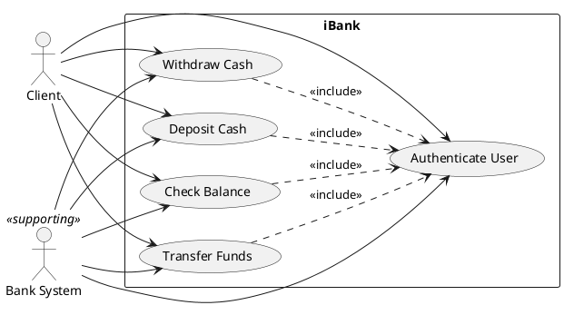

This is a draft suggestion generated by a GAI tool. It must be critically reviewed, adapted to your project, and verified against official sources before submission. No part of this document should be treated as final truth. Any legal or regulatory statements are summaries and must be checked by the team.

---

## 1. Recommended iBank ABM Concept & Simple Scope

**Recommended ABM concept**  
A standard bank-owned Automated Banking Machine that allows clients to withdraw cash, deposit funds (envelope-free simulation), transfer money between accounts, and check balances. It simulates card insertion by manually entering a card number, and all transactions run against a local simulated bank database. The interface supports English and French language selection to reflect Canadian bilingual requirements.

**Deliberately simple scope**  
The iBank prototype will be a Java GUI desktop application (Swing or JavaFX) with the following boundaries:

- **Allowed features:** User authentication via manual card number entry and PIN, view account balances, withdraw cash (simulated approval message), deposit funds (simulated credit), transfer between checking and savings accounts.
- **Excluded features:** Real card-reader hardware, biometrics, NFC/chip emulation, cryptocurrency, live Interac network integration, fraud scoring, physical cash management, real-time interbank transfers, and any hardware-level commands.
- **Why this is suitable:** This scope is small enough for a three‑student team to implement in a short delivery cycle, yet rich enough to produce meaningful source code for metrics like cyclomatic complexity, LCOM*, WMC, CF, SLOC, and use‑case points.

---

## 2. Slide‑by‑Slide Outline for Delivery 1

*Suggested slide titles and bullet points for a presentation; adjust as needed.*

**Slide 1 – Title**  
- Project iBank – Delivery 1: ABM Scope, Measurement Goal, and Use Case Model  
- Team members, date  

**Slide 2 – Problem 1: Selected ABM for Canada**  
- ABM type: standard bank-owned ABM, simulated card entry  
- Primary users: bank clients (everyday consumers)  
- Supported transactions: cash withdrawal, deposit, fund transfer, balance inquiry  
- Canadian context: legal under Bank Act, AML/ATF rules, accessible under Accessible Canada Act, bilingual UI  

**Slide 3 – Problem 1: Assumptions**  
- No real card hardware; card number entered manually  
- Local bank database, no live network  
- Simplified PIN verification, no encryption simulation  
- Transactions in Canadian dollars  
- Machine located in Canada, accessibility features simulated only where needed  

**Slide 4 – Problem 2: GQM Goal (SMART)**  
- Purpose: evaluate maintainability of iBank source code to improve it  
- Perspective: structural complexity and cohesion from developers’ viewpoint  
- Environment: student team, Java GUI, one term  
- SMART check summary table  

**Slide 5 – Problem 2: Questions and Metrics (1–3)**  
- Q1–Q3 with candidate metrics, collection method, and rationale  

**Slide 6 – Problem 2: Questions and Metrics (4–6)**  
- Q4–Q6; note Q6 cannot be fully answered by metric alone  

**Slide 7 – Problem 3: Actors and Use Case Definitions**  
- Actors: Client, Bank System (simulated)  
- Use cases: Authenticate User, Withdraw Cash, Deposit Cash, Transfer Funds, Check Balance  
- User‑story‑first organization  

**Slide 8 – Problem 3: Textual Use Case Table**  
- For each use case: preconditions, main success scenario, exceptions, postconditions  

**Slide 9 – Problem 3: Use Case Diagram**  
- PlantUML diagram with include relationships  

**Slide 10 – Future Deliverables Fit**  
- Why scope fits Java GUI implementation by three students  
- Candidate classes (no code)  
- How scope supports D3 metrics: SLOC, cyclomatic complexity, WMC, CF, LCOM*, UCP, correlation analysis  

**Slide 11 – GAI Use Explanation & Verification**  
- How the GAI output was obtained, required review steps  
- Parts that need external citation or verification  

**Slide 12 – Potential References to Verify**  
- Categories of sources (Bank Act, Interac rules, accessibility standards, GQM literature, C&K metrics, UML modeling)

---

## 3. Problem 1: ABM Selection, Description, and Assumptions

**Selected ABM type**  
A bank‑owned, free‑standing ABM that simulates a typical Canadian ATM. It supports cash withdrawal (simulated), envelope‑free deposits, fund transfers, and balance inquiries via a graphical touch‑screen interface, but all card reading is simulated through manual entry of a card number.

**Brief description**  
The machine behaves like a 21st‑century ABM commonly found in Canadian bank branches and off‑premises locations. It presents a bilingual (English/French) menu, accepts a customer’s card number and PIN, and after authentication offers a set of common banking transactions. Because this is a prototype, no physical cash is handled; a successful withdrawal or deposit is acknowledged by a confirmation message and an update to the simulated account balance.

**Primary users**  
Individual bank clients who hold checking or savings accounts with a Canadian financial institution.

**Supported transaction categories**  
- Cash withdrawal (simulated)  
- Cash/deposit (simulated)  
- Transfer between own accounts  
- Balance inquiry  

**Canadian context and legal/regulatory assumptions**  
- The ABM is assumed to be located in Canada and dispenses only Canadian dollars.  
- It is designed to comply with the *Bank Act* (Canada) and its regulations regarding consumer protection and disclosure.  
- As a federally regulated service, the ABM would need to offer services in both English and French under the *Official Languages Act*; therefore the prototype shall support language switching.  
- The *Accessible Canada Act* and related standards (e.g., CSA B651) require ATMs to be accessible to persons with disabilities. The prototype will not implement full hardware accessibility features but will be designed with keyboard navigation and clear labeling to represent accessible‑by‑design thinking.  
- Anti‑money laundering and terrorist financing rules (PCMLTFA) impose record‑keeping and reporting requirements. In the simulated environment, no real personal data is used and no reporting is required.  
- The ABM is assumed to operate within a closed testing environment and does not connect to Interac or any other payment network.

*Important:* The team must verify current Canadian ATM regulations, OSFI guidance, and Interac rules before finalising the description. This summary is a starting point, not legal advice.

**Explicit project assumptions (iBank)**  
1. Card reading is simulated: the user selects a pre‑loaded sample card number from a drop‑down list or types it into a text field.  
2. PIN verification is a simple string comparison against a stored PIN in a local “database” (e.g., a text file or hard‑coded map).  
3. No encryption or hashing is implemented; this is a functional prototype.  
4. Account balances are stored in memory and reset on program restart.  
5. The machine always has enough “cash” to honour withdrawal requests; no cash‑out‑of‑service scenario is simulated.  
6. Deposit envelopes are not modeled; a deposit simply credits the chosen account.  
7. The system supports exactly two account types per client: checking and savings.  
8. The user interface will be built with Java Swing or JavaFX and will run on a standard desktop environment.  

---

## 4. Problem 2: GQM Goal, Questions, and Metrics

### 4.1 SMART GQM Goal

**Purpose:** To **evaluate** the **maintainability** of the iBank source code in order to **improve** it.  
**Perspective:** Examine **structural complexity and cohesion** from the viewpoint of the **software developers**.  
**Environment:** In the context of a **three‑student team** building a Java GUI ABM simulation over one academic term.

### 4.2 SMART Check

| SMART element | Evidence in the goal | Possible weakness |
|---------------|----------------------|-------------------|
| **S**pecific   | Focuses on maintainability of the iBank source code, a concrete deliverable. | “Maintainability” is a broad quality attribute; must be broken into measurable sub‑characteristics. |
| **M**easurable | Will be answered by concrete metrics (cyclomatic complexity, LCOM*, WMC, etc.). | Metrics alone cannot fully capture all dimensions of maintainability (see Q6). |
| **A**ttainable  | The team will write the code and can run static analysis tools to collect the metrics. | Requires access to appropriate tools (e.g., Eclipse Metrics, SonarQube) – must be verified. |
| **R**ealistic   | The scope is small and the metrics are feasible to gather within the project timeline. | The number of classes and methods must be non‑trivial; the design must be planned to yield meaningful metric values. |
| **T**imely      | Evaluation will be performed during the D3 evaluation phase, after implementation. | Measurements must be collected before the final report deadline. |

### 4.3 Six Questions (2N = 6) and Candidate Metrics

**Q1:** What is the cyclomatic complexity of each method in the iBank system?  
- **Candidate metric:** McCabe Cyclomatic Complexity (CC).  
- **Objective / subjective:** Objective.  
- **Entity:** Method.  
- **Attribute:** Control‑flow complexity.  
- **Unit / scale:** Integer count (ratio scale).  
- **Collection method:** Automated static analysis tool (e.g., Eclipse Metrics, SonarQube).  
- **Why it helps answer the question:** Cyclomatic complexity directly indicates the number of linearly independent paths; higher values suggest methods that are harder to test and understand, which impacts maintainability.

**Q2:** How many methods have a cyclomatic complexity greater than 10?  
- **Candidate metric:** Count of methods with CC > 10.  
- **Objective / subjective:** Objective.  
- **Entity:** System methods.  
- **Attribute:** Frequency of complex methods.  
- **Unit / scale:** Count (absolute frequency).  
- **Collection method:** Filter CC results from Q1 and count.  
- **Why it helps answer the question:** A high count of complex methods flags areas where refactoring is most needed, giving a risk profile for maintainability.

**Q3:** What is the Weighted Methods per Class (WMC) for each class?  
- **Candidate metric:** WMC (sum of CC of all methods in a class, or number of methods, depending on definition). We will use the sum‑of‑complexities definition.  
- **Objective / subjective:** Objective.  
- **Entity:** Class.  
- **Attribute:** Class‑level complexity.  
- **Unit / scale:** Integer sum.  
- **Collection method:** Static analysis tool (same as CC, aggregated per class).  
- **Why it helps answer the question:** WMC correlates with development and testing effort; classes with very high WMC are harder to maintain and should be examined.

**Q4:** What is the Lack of Cohesion of Methods (LCOM*) for each class?  
- **Candidate metric:** LCOM* (Henderson‑Sellers variant).  
- **Objective / subjective:** Objective.  
- **Entity:** Class.  
- **Attribute:** Cohesion of methods.  
- **Unit / scale:** Real number (typically 0–2, higher means less cohesive).  
- **Collection method:** Computed by a static analysis tool that examines method‑attribute access.  
- **Why it helps answer the question:** Low cohesion suggests a class does too many unrelated things, making it harder to understand and modify, thus reducing maintainability.

**Q5:** What is the Coupling Factor (CF) between classes in the iBank system?  
- **Candidate metric:** Coupling Factor = (number of actual client‑supplier relationships) / (maximum possible relationships among all non‑inheritance pairs).  
- **Objective / subjective:** Objective.  
- **Entity:** System (set of classes).  
- **Attribute:** Inter‑class coupling intensity.  
- **Unit / scale:** Ratio between 0 and 1.  
- **Collection method:** Extract method calls from source code using a dependency analyzer.  
- **Why it helps answer the question:** High coupling makes the system brittle; changing one class may force changes in many others, harming maintainability.

**Q6:** How easy is it for a new developer to understand the iBank source code?  
- **Candidate metrics:**  
  - Comment density (comment lines / total lines).  
  - Average identifier length (characters).  
  - Ratio of explanatory comments to logical SLOC.  
- **Objective / subjective:** Comment density and identifier length are **objective** to compute, but they are only weak proxies for understandability; true understandability is inherently **subjective**.  
- **Entity:** Source code (files or classes).  
- **Attribute:** Understandability/readability.  
- **Unit / scale:** Percentage, average character count, ratio.  
- **Collection method:** Static analysis tools (e.g., CLOC, custom script).  
- **Why it helps answer the question (partially):** Higher comment density and meaningful long identifiers *may* indicate better self‑explanatory code. However, these metrics are easily gamed and cannot guarantee actual comprehension.  
- **Why this question cannot be well answered by a metric alone:** Understandability is multi‑faceted and context‑dependent. A method may have low comment density yet be trivially readable because of a clear algorithm, while another with high comment density may still be confusing. No single metric or combination of simple metrics can replace a human code review. Therefore, this question must be supplemented with qualitative techniques such as a think‑aloud walkthrough with a new team member or a readability survey.

---

## 5. Problem 3: Use Case Model

### 5.1 Actor Definitions

| Actor | Description |
|-------|-------------|
| **Client** | A bank customer who wants to perform transactions using the iBank ABM. The client interacts with the ABM’s graphical interface. |
| **Bank System** (supporting) | The simulated back‑end system that stores account information, verifies credentials, and records transactions. In the prototype, this is a local module or a set of classes, not an external network service. |

*Note: A “Maintainer” actor (for cash replenishment, receipt paper, etc.) is deliberately omitted to keep the scope minimal and aligned with the simulation boundaries.*

### 5.2 Use Case Definitions (User‑Story‑First)

| Use case | User story | Acceptance notes for prototype |
|----------|------------|--------------------------------|
| **Authenticate User** | As a bank client, I want to identify myself with a card number and PIN so that I can access my accounts securely. | – The system presents a card entry screen (dropdown or text field). – After entering a valid card number and PIN, the main menu appears. – If the combination is invalid, an error message is shown and the client may retry up to three times. |
| **Withdraw Cash** | As a bank client, I want to withdraw a specific amount from my checking account so that I can obtain cash. | – After authentication, the client selects “Withdraw”. – The system displays preset amounts and an “other amount” option. – On success, a confirmation screen shows the new balance and a simulated “cash dispensed” message. |
| **Deposit Cash** | As a bank client, I want to deposit cash into my account so that my balance reflects the new funds. | – After authentication, the client selects “Deposit”. – The client enters the amount to deposit. – The system credits the selected account and shows a confirmation. |
| **Transfer Funds** | As a bank client, I want to move money between my checking and savings accounts so that I can manage my finances. | – After authentication, the client chooses “Transfer”. – Selects source and destination accounts, enters amount. – On success, both balances are displayed. |
| **Check Balance** | As a bank client, I want to view my current account balances so that I know how much money is available. | – After authentication, the client selects “Balance”. – The system shows the balances of checking and savings accounts on one screen. |

### 5.3 Textual Use Case Model

| Use case | Primary actor | Supporting actor | Preconditions | Main success scenario | Exceptions | Postconditions |
|----------|---------------|------------------|---------------|------------------------|------------|----------------|
| **Authenticate User** | Client | Bank System | ABM is idle, sample card numbers and PINs exist in the Bank System | 1. Client selects “Start”. 2. System displays card entry screen. 3. Client enters card number. 4. System asks for PIN. 5. Client enters PIN. 6. Bank System validates credentials. 7. System displays main transaction menu. | 3a,5a: invalid card number or PIN → error message, retry counter incremented; after three failures, session ends. | Client is authenticated; a session object is created. |
| **Withdraw Cash** | Client | Bank System | Client is authenticated, at least one account has sufficient balance. | 1. Client selects “Withdraw”. 2. System asks for account (defaults to checking). 3. Client selects or enters amount. 4. System verifies sufficient funds via Bank System. 5. System deducts amount, displays confirmation and new balance. | 4a: insufficient funds → error, ask for a different amount. | Account balance decreased; withdrawal transaction logged. |
| **Deposit Cash** | Client | Bank System | Client is authenticated. | 1. Client selects “Deposit”. 2. System asks for target account. 3. Client enters amount. 4. System credits the account via Bank System. 5. System displays confirmation and new balance. | None beyond input validation (negative amount) → error. | Account balance increased; deposit transaction logged. |
| **Transfer Funds** | Client | Bank System | Client is authenticated, both source and destination accounts exist. | 1. Client selects “Transfer”. 2. System asks for source and destination accounts. 3. Client enters amount. 4. System verifies sufficient funds in source account. 5. System moves amount, updates both accounts. 6. Displays updated balances. | 4a: insufficient funds → error. | Source balance decreased, destination balance increased; transfer record logged. |
| **Check Balance** | Client | Bank System | Client is authenticated. | 1. Client selects “Balance”. 2. System retrieves account balances from Bank System. 3. System displays checking and savings balances. | None. | No state change; balances displayed. |

### 5.4 Graphical Use Case Diagram (PlantUML)

**Diagram notes**  
- `<<include>>` relationships indicate that **Authenticate User** is a mandatory part of every transaction flow; the user must be authenticated before withdrawing, depositing, transferring, or checking balance. This avoids duplication in the textual use cases and reflects the requirement that no transaction occurs without a valid session.  
- No `<<extend>>` or generalization relationships were used because the current feature set is simple and there are no optional extension points.

---

## 6. Future Deliverables Fit

**Why the selected ABM scope can be implemented by a three‑student team in Java Swing/JavaFX**  
The feature set is small (5 use cases, one authentication step shared by all). The GUI can be built with standard widgets (buttons, text fields, labels) and managed by a simple state machine (login screen → main menu → transaction screens → confirmation). No networking, no databases, and no external hardware libraries are needed. This keeps the implementation effort manageable for a three‑person team over one deliverable.

**Candidate simple classes that may later exist in D2 (without code)**  
- `ATMSession` – holds the authenticated user’s state.  
- `Account` – represents a checking or savings account with a balance and an account number.  
- `BankDatabase` – stores a collection of sample accounts and PIN‑card mappings.  
- `Card` – aggregates card number and associated client.  
- `Transaction` – abstract class or simple data object for recording transaction details.  
- `Withdrawal`, `Deposit`, `Transfer` – possibly subclasses or methods.  
- GUI classes: `LoginScreen`, `MainMenu`, `WithdrawScreen`, `DepositScreen`, `TransferScreen`, `BalanceScreen`.

These classes will provide enough structural variety to compute the D3 metrics.

**Why the scope supports later D3 metrics**  
- **SLOC:** Logical source lines can be counted per class and per method.  
- **Cyclomatic complexity (CC):** Each method that contains branches (e.g., pin retry logic, insufficient funds handling) will yield meaningful CC values.  
- **WMC:** Summing CC per class gives WMC, enabling comparison of class‑level complexity.  
- **LCOM*:** Cohesion can be measured because classes will have attributes (balances, card numbers) and methods that access them; shared use of attributes across methods will reveal cohesion.  
- **CF:** The dependency between GUI classes and the core `BankDatabase` will generate a coupling factor.  
- **UCP (Use Case Points):** The actors and use cases defined here provide exactly the inputs needed to calculate unadjusted use case points and later correlate UCP with actual effort or SLOC.  
- **Correlation analysis:** The team can intentionally inject a few defects or measure review time, then look for relationships between, say, high CC and number of issues found. This makes the project “rich enough” without becoming overwhelmingly large.

---

## 7. GAI Use Explanation

**What this prompt was intended to obtain**  
The present output was generated by prompting a GAI tool (LLM) to act as a software measurement analyst and requirements analyst, using the CASTROFF framework. The objective was to produce draft content for Delivery 1 of the iBank project, covering an ABM selection, a GQM goal with six questions, a use case model, and alignment with later deliverables, all while respecting course concepts and Canadian context constraints.

**How the output should be reviewed and modified before submission**  
- **Accuracy check:** All statements about Canadian laws, regulations, and Interac rules are high‑level summaries. You must replace them with precise, verified information from official sources (e.g., *Bank Act*, Accessible Canada Act, OSFI).  
- **GQM goal refinement:** Ensure the goal truly reflects your project’s measurement objectives. Adjust questions or metrics if your design differs from the assumed scope.  
- **Use case model verification:** Walk through the scenarios with the team to confirm that no needed steps are missing and that the `<<include>>` structure matches your intended authentication flow.  
- **Metrics validation:** Confirm that the tools you plan to use (e.g., Eclipse Metrics plugin, SonarQube community edition) can actually compute LCOM*, CF, etc., for your codebase.  
- **Plagiarism and wording:** The text has been phrased originally. Nevertheless, you must re‑read it and rephrase any passages that feel too generic or that might accidentally resemble any source text you consult.  
- **References:** The last section lists categories; you must locate and cite specific, verifiable sources before submitting.

**What parts require external citation or verification**  
- Canadian regulatory framework (Bank Act, Accessible Canada Act, Official Languages Act, PCMLTFA).  
- Accessibility standard CSA B651.  
- Interac association rules and operating guidelines (e.g., shared cash dispensing).  
- GQM methodology (Basili, Caldiera, Rombach) – cite the original paper.  
- Definitions of the CK metrics (Chidamber & Kemerer) and LCOM* (Henderson‑Sellers).  
- Use case modeling (UML; cite the UML specification or a recognized textbook).  
- Any specific tool documentation if you rely on a particular metric implementation.

---

## 8. Potential References To Verify

The team should locate and verify information from sources in these categories. The list below suggests categories, not exact bibliographic details.

1. **Canadian banking legislation and regulation**  
   - *Bank Act*, S.C. 1991, c. 46 (Department of Justice Canada).  
   - *Proceeds of Crime (Money Laundering) and Terrorist Financing Act* (PCMLTFA).  
   - *Accessible Canada Act*, S.C. 2019, c. 10.  
   - Office of the Superintendent of Financial Institutions (OSFI) guidance for ATM operations.

2. **ATM and accessibility standards**  
   - CSA B651, “Accessible design for the built environment” (insofar as it covers ATMs).  
   - Interac rules for shared ATMs (Interac Corp.).  

3. **Software measurement and GQM**  
   - Basili, V. R., Caldiera, G., & Rombach, H. D. (1994). *The Goal Question Metric Approach*. Encyclopedia of Software Engineering.  
   - van Solingen, R., & Berghout, E. (1999). *The Goal/Question/Metric Method: A practical guide for quality improvement of software development*. McGraw‑Hill.

4. **CK metrics and cohesion/coupling definitions**  
   - Chidamber, S. R., & Kemerer, C. F. (1994). *A Metrics Suite for Object Oriented Design*. IEEE Transactions on Software Engineering, 20(6).  
   - Henderson‑Sellers, B. (1996). *Object‑Oriented Metrics: Measures of Complexity*. Prentice‑Hall.

5. **Use case modeling and UML**  
   - Object Management Group (OMG). *Unified Modeling Language (UML) Specification*, version 2.5.1.  
   - Cockburn, A. (2001). *Writing Effective Use Cases*. Addison‑Wesley.

6. **Java GUI technologies**  
   - Official Java Swing / JavaFX documentation (Oracle). Used to confirm capability and feasibility statements.

*Reminder: All claims drawn from these sources must be verified and properly cited in your delivery. Do not assume that a mention in this list is itself an adequate citation.*
