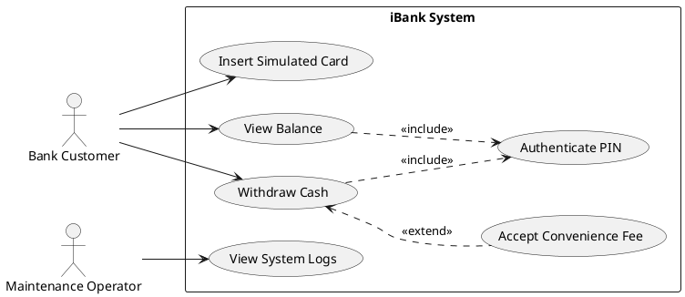

Here is a comprehensive guide and draft material for Delivery 1 of the iBank project. I am acting as your software measurement analyst and requirements analyst, providing evidence-based, structured recommendations tailored to your constraints.

---

### 1. Recommended ABM Concept & Scope

**Concept:** A "White-Label" Retail Cash Dispenser.
**Why it is suitable for Canada:** In Canada, the Interac network allows independent operators to deploy "white-label" ATMs in convenience stores, malls, and gas stations. These machines focus strictly on cash dispensing and balance inquiries, avoiding the regulatory and hardware complexities of deposit-taking branch ATMs. 
**Recommended Simple Scope:** 
To ensure the project is easily implementable in Java (Swing/JavaFX) for Delivery 2 while providing enough structural complexity for Delivery 3 metrics, limit the scope to:
*   **Simulated Card Entry:** A GUI dropdown or text field to select/enter a mock card number.
*   **PIN Authentication:** Basic validation against a local mock database or hardcoded data structure.
*   **View Balance:** Displaying the account balance.
*   **Withdraw Cash:** Deducting a requested amount (in fixed $20 or $50 denominations) and simulating the dispensing process via GUI messages.
*   *Excluded:* Real payment-network integration, real card-reader hardware, biometric authentication, cryptocurrency, interbank transfers, fraud scoring, and hardware-level cash management.

---

### 2. Slide-by-Slide Outline for D1 Presentation

*   **Slide 1: Title Slide** (Project iBank, Team Members, Course Name)
*   **Slide 2: iBank Concept & Scope** (Problem 1: White-label retail ABM, core features: Withdraw, Balance, Simulated Card)
*   **Slide 3: Canadian Context & Assumptions** (Problem 1: Interac-style model, bilingual support assumption, simulated hardware)
*   **Slide 4: Measurement Goal - GQM** (Problem 2: The SMART Goal statement and SMART criteria check)
*   **Slide 5: GQM Questions 1-3** (Problem 2: Questions focusing on code complexity and size)
*   **Slide 6: GQM Questions 4-6 & Metric Limitations** (Problem 2: Questions on effort, reliability, and usability; discussion on metric limitations)
*   **Slide 7: System Actors & User Stories** (Problem 3: Customer, Admin, and key user stories)
*   **Slide 8: Graphical Use Case Model** (Problem 3: UML Diagram)
*   **Slide 9: Textual Use Case Definitions** (Problem 3: Main success scenarios and exceptions)
*   **Slide 10: Future Deliverables Fit** (How this scope supports D2 Java implementation and D3 metric extraction)

---

### 3. Problem 1: ABM Selection and Description

*   **Selected ABM Type:** Retail Cash Dispenser (White-label ATM).
*   **Brief Description:** A self-service machine designed for non-bank retail locations. It allows users to access their primary checking/savings accounts to withdraw physical currency or check their current balance.
*   **Primary Users:** 
    *   *Bank Customer:* The end-user performing financial transactions.
    *   *Maintenance Operator:* The technician who refills cash and extracts local system logs (simulated).
*   **Supported Transaction Categories:** Cash Withdrawal, Balance Inquiry.
*   **Canadian Context and Legal/Regulatory Assumptions:**
    *   *Fee Disclosure:* Canadian regulations (overseen by the Financial Consumer Agency of Canada - FCAC) require clear disclosure of convenience fees before a transaction is finalized. iBank will simulate a fee acceptance screen.
    *   *Bilingualism:* While only federally regulated entities are strictly mandated to provide English and French, it is a standard business practice in Canada. (Assumption: The prototype will default to English but architecture should theoretically support localization).
*   **Explicit Project Assumptions:**
    *   Card reading is simulated via manual GUI entry.
    *   Network connectivity to a central bank server is simulated via local, mock Java objects.
    *   Cash dispensing is simulated via a success message on the GUI; no hardware drivers are required.

---

### 4. Problem 2: Goal-Question-Metric (GQM) Approach

**SMART GQM Goal:**
*   **Purpose:** To *evaluate* the *iBank software prototype* in order to *improve* it.
*   **Perspective:** Examine *code maintainability and implementation effort* from the viewpoint of the *development team*.
*   **Environment:** In the context of *a 3-person student project using Java GUI and Agile/DevOps practices*.

**SMART Check Table:**

| SMART Element | Evidence in the Goal | Possible Weakness |
| :--- | :--- | :--- |
| **Specific** | Targets "code maintainability and implementation effort" of the "iBank software prototype". | "Improve" is slightly broad; relies on the questions to define what improvement looks like. |
| **Measurable** | Maintainability and effort can be quantified using structural code metrics and Use Case Points. | Requires strict adherence to metric definitions to ensure consistent measurement. |
| **Attainable** | The team has access to static analysis tools (or can calculate manually) for a small Java codebase. | Manual calculation of complex metrics (like LCOM*) might be error-prone if the codebase grows too large. |
| **Realistic** | Fits the constraints of D2 (implementation) and D3 (evaluation) without requiring enterprise tools. | None, highly aligned with course requirements. |
| **Timely** | Bounded by the academic semester and the delivery schedule (D2 to D3). | Time constraints may limit the ability to refactor code after initial measurement. |

**GQM Questions and Metrics (Exactly 2N = 6 Questions):**

| # | Question | Candidate Metric(s) | Obj/Subj | Entity | Attribute | Unit/Scale | Collection Method | Rationale / Does it help? |
| :-- | :--- | :--- | :--- | :--- | :--- | :--- | :--- | :--- |
| **Q1** | How complex is the control flow of the transaction logic? | Cyclomatic Complexity (CC) | Objective | Source Code (Methods) | Control flow complexity | Integer (Paths) | Static analysis tool / Manual count | **Yes.** High CC is an indicator of low maintainability. Helps identify methods needing refactoring. |
| **Q2** | How well-encapsulated are the classes handling user sessions? | Lack of Cohesion in Methods (LCOM*) | Objective | Source Code (Classes) | Cohesion | Ratio/Float | Static analysis tool | **Yes.** Helps answer if the `SessionManager` or `Transaction` classes are doing too many unrelated things. |
| **Q3** | How large is the codebase required to implement the core features? | Logical Source Lines of Code (SLOC) | Objective | Source Code | Size | Integer (Lines) | Automated script / IDE plugin | **Yes.** Provides a baseline measure of size to normalize other metrics (e.g., defect density). |
| **Q4** | How much effort is estimated to implement the use cases? | Use Case Points (UCP) | Objective | Requirements (Use Cases) | Size/Effort | Number (UCP) | Manual calculation from UC model | **Yes.** Translates requirements complexity into an effort indicator, useful for Agile sprint planning. |
| **Q5** | How tightly coupled are the GUI classes to the transaction logic? | Coupling Between Objects (CBO) / Fan-out | Objective | Source Code (Classes) | Coupling | Integer (Dependencies) | Static analysis tool | **Yes.** High coupling indicates poor maintainability. We want the GUI separated from the logic. |
| **Q6** | How intuitive is the simulated user interface for the end-user? | User Satisfaction Rating | Subjective | Software Prototype | Usability | Ordinal (1-5 scale) | User survey / Questionnaire | **No (Not by code metrics alone).** See limitation note below. |

**Metric Limitations (Addressing Q6):**
Question 6 *cannot* be answered well by a software metric alone. Measurement assigns numbers to attributes according to rules, but "intuitiveness" is a highly subjective, external quality attribute. A single measure (like a survey score) without context is not enough for interpretation. To truly answer Q6, the team would need human-in-the-loop usability testing, observing user error rates and gathering qualitative feedback, rather than relying on static code metrics.

---

### 5. Problem 3: Use Case Model

**Actor Definitions:**
1.  **Bank Customer (Primary):** A person holding a bank account who interacts with the ABM to view balances or withdraw cash.
2.  **Maintenance Operator (Supporting):** A technician who accesses a hidden menu to simulate restocking cash or viewing system logs.

**Use Case Definitions & User Stories:**

| Use Case | User Story | Acceptance Notes for Prototype |
| :--- | :--- | :--- |
| **UC1: Insert Simulated Card** | As a customer, I want to input my card number so the system can identify my account. | GUI must have a text field or dropdown. Must transition to PIN screen upon submission. |
| **UC2: Authenticate PIN** | As a customer, I want to enter a secure PIN so that only I can access my funds. | Must validate against a mock database. 3 failed attempts should lock the session. |
| **UC3: View Balance** | As a customer, I want to see my current account balance so I know how much money I have. | Must display the correct balance linked to the authenticated card. |
| **UC4: Withdraw Cash** | As a customer, I want to withdraw cash so I can have physical currency. | Must check for sufficient funds, deduct amount, and show a "Cash Dispensed" message. |

**Textual Use Case Model (Example for UC4: Withdraw Cash):**

| Element | Description |
| :--- | :--- |
| **Use Case** | UC4: Withdraw Cash |
| **Primary Actor** | Bank Customer |
| **Preconditions** | Customer has successfully completed UC1 (Insert Card) and UC2 (Authenticate PIN). |
| **Main Success Scenario** | 1. Customer selects "Withdraw Cash".  2. System prompts for amount (multiples of $20).  3. Customer enters amount.  4. System verifies sufficient funds in the account.  5. System deducts funds and updates balance.  6. System displays "Please take your cash". |
| **Exceptions** | 4a. Insufficient funds: System displays error and returns to main menu.  3a. Invalid amount (not a multiple of $20): System displays error and asks for re-entry. |
| **Postconditions** | Account balance is reduced by the withdrawal amount. |

**Graphical Use Case Diagram (PlantUML Syntax):**
*You can copy and paste this code into a PlantUML viewer (like PlantText.com) to generate the image for your slides/report.*

**Notes on Relationships:**
*   **`<<include>>`**: Both *View Balance* and *Withdraw Cash* include *Authenticate PIN*. The user cannot perform these actions without the system executing the authentication behavior.
*   **`<<extend>>`**: *Accept Convenience Fee* extends *Withdraw Cash*. It is an optional behavior that only triggers under specific conditions (e.g., if the simulated card belongs to a different bank network).

---

### 6. Future Deliverables Fit

*   **Why this scope works for a 3-student team in Java:** The scope is strictly bounded. By simulating the hardware and network, the team can focus entirely on object-oriented design and GUI event handling in Java Swing/JavaFX, easily completing it within a few Agile sprints.
*   **Potential D2 Classes (No code required yet):** `MainGUI`, `CardSimulator`, `SessionController`, `Account`, `TransactionManager`, `CashDispenserSimulator`.
*   **Support for D3 Metrics:** 
    *   *SLOC & Readability:* The codebase will be large enough to measure but small enough to read manually.
    *   *Cyclomatic Complexity (CC) & WMC:* The logic for PIN validation (loops, conditionals) and fund checking provides excellent control flow structures to measure.
    *   *LCOM* & Coupling:* Separating the GUI from the `TransactionManager` allows for meaningful measurement of cohesion and coupling.
    *   *UCP:* The 4-6 clearly defined use cases provide a perfect baseline for calculating Use Case Points.

---

### 7. GAI Use Explanation

*   **Intent of Prompt:** This prompt was designed using the CASTROFF framework to generate a structured, evidence-based foundation for Delivery 1 of a software measurement project, ensuring alignment with course concepts (GQM, metric definitions) and project constraints (team size of 3, simple Java GUI scope).
*   **How to Review and Modify:** Do not copy this output verbatim into your final submission. You must review the GQM questions to ensure your team agrees with them. You should format the PlantUML diagram into a visual image. Adjust the user stories to match your team's specific Agile tracking tool (e.g., Jira, Trello).
*   **Parts Requiring External Citation:** The definitions of GQM, Cyclomatic Complexity, LCOM*, and Use Case Points must be cited in your final report using your course textbook or academic papers. The Canadian ATM fee regulations should be cited using official government sources.

---

### 8. Potential References To Verify

*(Note: As requested, I am providing credible source categories and known authors rather than inventing exact bibliographic details. You must look these up and format them in APA/IEEE style for your report).*

1.  **GQM Methodology:** Look for the original papers by **Victor R. Basili** (e.g., "Software Modeling and Measurement: The Goal/Question/Metric Paradigm", 1992).
2.  **Software Metrics (CC, LCOM*, SLOC):** Reference your course textbook or foundational texts like **Norman Fenton** ("Software Metrics: A Rigorous and Practical Approach") or **Chidamber & Kemerer** (for object-oriented metrics).
3.  **Use Case Modeling & UML:** Reference **Martin Fowler** ("UML Distilled") or **Ivar Jacobson** (creator of Use Cases).
4.  **Canadian Banking Context:** Search the official website of the **Financial Consumer Agency of Canada (FCAC)** for guidelines on "ATM fees" and "convenience fees" to cite the regulatory context for Problem 1.
