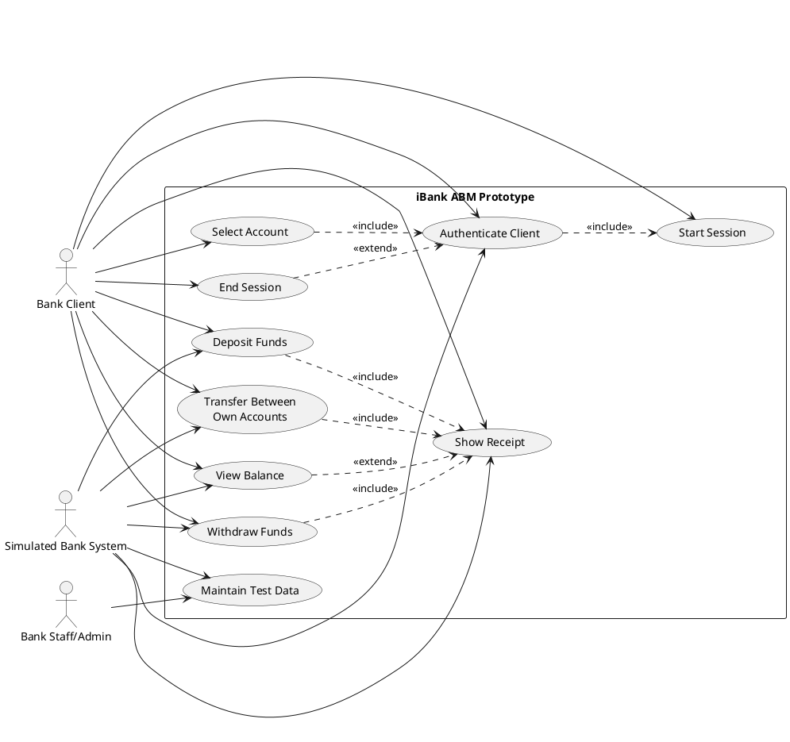

## Recommended ABM Concept

Use a **simulated Canadian bank lobby ABM prototype** for iBank. It should act like a basic automated banking machine used by bank clients in Canada, but without real banking networks, real card-reader hardware, real cash hardware, or real payment processing.

This is suitable because it reflects a familiar Canadian ABM context while remaining realistic for a student Java GUI implementation. Card reading should be simulated by entering or selecting a sample card number.

## Recommended Simple Scope

Keep iBank limited to:

- Simulated card number entry or sample card selection
- PIN authentication using test data only
- Account selection: chequing or savings
- Balance inquiry
- Simulated withdrawal
- Simulated deposit
- Transfer between own accounts
- Receipt display or save-to-text option
- Session logout

Avoid:

- Real payment-network integration
- Real card-reader hardware
- Biometrics
- Cryptocurrency
- Live interbank transfers
- Fraud scoring
- Hardware-level cash management
- Real customer banking data

---

# Slide-By-Slide D1 Outline

## Slide 1: Project Context

- Project: iBank Automated Banking Machine
- Goal: simple ABM prototype for Canadian use context
- Development style: agile and DevOps-informed
- Implementation target: Java Swing or JavaFX GUI

## Slide 2: Selected ABM Concept

- Simulated Canadian bank lobby ABM
- Manual/sample card selection instead of real card reader
- Supports common self-service banking tasks
- Designed for prototype, measurement, and evaluation

## Slide 3: Problem 1: ABM Description

- Type: lobby-style bank ABM
- Primary users: bank clients and bank staff/admin
- Transactions: login, balance, withdrawal, deposit, own-account transfer, receipt, logout
- Legal/regulatory assumptions require verification against Canadian sources

## Slide 4: Problem 1: Assumptions

- No real money movement
- No real customer data
- Test accounts only
- No connection to payment networks
- GUI simulates hardware actions
- Accessibility and privacy are considered at prototype level

## Slide 5: Problem 2: GQM Goal

- Measurement goal focuses on prototype maintainability and implementability
- Entity: iBank Java GUI prototype
- Purpose: evaluate whether scope is suitable for D2 and D3
- Stakeholder viewpoint: student developers and course evaluators

## Slide 6: Problem 2: SMART Check

- Specific: targets defined prototype scope
- Measurable: uses complexity, size, cohesion, coupling, use case, and review metrics
- Attainable: feasible for three students
- Realistic: avoids high-risk integrations
- Timely: evaluated during D2/D3

## Slide 7: Problem 2: GQM Questions

- Six questions because N = 3, so 2N = 6
- Questions connect goal to metrics
- Metrics are selected for rationale, feasibility, objectivity, and usefulness
- Some questions need interpretation beyond metrics alone

## Slide 8: Problem 3: Actors

- Bank Client
- Bank Staff/Admin
- Simulated Bank System
- Optional: Course Evaluator as analysis stakeholder, not runtime actor

## Slide 9: Problem 3: User Stories

- User-story-first organization
- Each story maps to one use case
- Acceptance notes focus on prototype behavior

## Slide 10: Problem 3: Use Case Model

- Graphical PlantUML or Mermaid diagram
- Textual use case table
- Include/extend relationships kept minimal

## Slide 11: Future Deliverables Fit

- Java GUI implementation is feasible
- Supports later metrics: SLOC, readability, cyclomatic complexity, WMC, CF, LCOM*, UCP
- Scope is rich enough for evaluation but not oversized

## Slide 12: GAI Use and References

- GAI used to draft and organize D1 content
- Team must verify Canadian legal/regulatory claims
- Team must cite GQM, UML/use case, accessibility, privacy, and ABM/ATM guidance sources

---

# Problem 1: Selected ABM

## Selected ABM Type

**Simulated Canadian bank lobby ABM for basic retail banking transactions.**

This ABM represents a self-service machine located inside or near a Canadian bank branch. For the student prototype, it is implemented as a Java GUI application with simulated card input and test accounts.

## Brief Description

iBank allows a bank client to start a session, enter or select a test card number, authenticate with a PIN, choose an account, complete simple transactions, view a receipt, and log out.

The ABM is not connected to real banking infrastructure. It is a prototype for requirements, design, implementation, and software measurement.

## Primary Users

| User | Description |
|---|---|
| Bank Client | Uses the ABM to perform simple banking transactions. |
| Bank Staff/Admin | Maintains test accounts, sample balances, and prototype configuration. |
| Course Evaluator | Reviews the project artifacts and later measurement results. Not a runtime ABM user. |

## Supported Transaction Categories

| Category | Included Prototype Functions |
|---|---|
| Authentication | Simulated card number entry/selection and PIN validation |
| Account information | Balance inquiry |
| Cash transaction simulation | Withdrawal and deposit using simulated amounts |
| Internal movement | Transfer between the user's own chequing and savings accounts |
| Session management | Receipt display and logout |

## Canadian Context and Legal/Regulatory Assumptions

These are assumptions for the student prototype and should be verified before submission:

| Area | Assumption |
|---|---|
| Privacy | The prototype uses only fictional test data, so it should avoid collecting real personal banking information. If real personal information were used, Canadian privacy law such as PIPEDA or applicable provincial privacy law would need review. |
| Banking legality | Because iBank does not process real transactions or hold real funds, it is treated as an educational simulation, not an operating financial institution. |
| Accessibility | The GUI should consider Canadian accessibility expectations, such as readable text, keyboard navigation, clear labels, and sufficient contrast. Specific legal duties depend on jurisdiction and deployment context. |
| Consumer banking rules | Real ABMs in Canada may be subject to banking, payment-network, fee disclosure, accessibility, and security requirements. iBank should not claim compliance unless checked against official sources. |
| Security | PINs and account data are fictional. Still, the prototype should avoid displaying PINs and should reset sessions after logout. |

## Explicit Project Assumptions

- iBank is an educational prototype, not a production ABM.
- No real bank cards are used.
- Card reading is simulated through manual entry or GUI selection.
- All account records are fictional.
- No real money is deposited, withdrawn, transferred, or settled.
- The prototype does not connect to Interac, Visa, Mastercard, a bank core system, or any payment network.
- The prototype will be implemented by three students using Java Swing or JavaFX.
- The scope is intentionally small to support D2 implementation and D3 measurement.
- Claims about Canadian law, banking regulation, accessibility, and security must be verified with credible sources before final submission.

---

# Problem 2: GQM Goal

## Measurement Terms

| Term | Meaning in iBank |
|---|---|
| Measure | A raw observed value, such as "method has 7 decision points" or "class has 120 logical SLOC." |
| Metric | A defined measurement rule, such as cyclomatic complexity per method. |
| Indicator | An interpreted result, such as "high-risk class for refactoring" based on several measures and thresholds. |

## SMART GQM Goal

**Purpose:** To **evaluate** the **iBank Java GUI ABM prototype design and implementation** in order to **control its complexity and confirm that it is feasible for D2 implementation and D3 measurement**.

**Perspective:** Examine **maintainability, understandability, and measurement readiness** from the viewpoint of **the three-student development team and course evaluator**.

**Environment:** In the context of **a Software Measurement course project using agile/DevOps practices, a Java Swing or JavaFX prototype, simulated ABM transactions, and D3 evaluation metrics collected after implementation**.

## SMART Check Table

| SMART element | Evidence in the goal | Possible weakness |
|---|---|---|
| Specific | Focuses on iBank Java GUI ABM prototype design and implementation. | Maintainability and understandability still need operational definitions. |
| Measurable | Mentions complexity, feasibility, and measurement readiness. | Thresholds must be chosen carefully and justified. |
| Attainable | Scope is limited to simulated basic transactions. | GUI work may still take time if the team over-designs screens. |
| Realistic | Avoids real banking networks, hardware, biometrics, and payment processing. | Some banking behavior may need simplification. |
| Timely | Designed for D2 implementation and D3 measurement. | Exact measurement dates should match the course schedule. |

## Exactly 6 GQM Questions and Candidate Metrics

### Q1. Is the iBank scope small enough for a three-student team to implement in D2?

| Candidate metric | Objective or subjective | Entity | Attribute | Unit or scale | Collection method | Why it helps |
|---|---|---|---|---|---|---|
| Number of use cases | Objective | Requirements model | Functional size | Count | Count approved use cases | Helps estimate whether the functional scope is manageable. |
| Unadjusted Use Case Points | Objective with judgment inputs | Use case model | Functional size/effort | UCP score | Classify actors/use cases and calculate UCP | Gives a structured effort estimate. |
| Estimated story effort | Subjective | User stories | Implementation effort | Story points or small/medium/large | Team planning session | Captures team judgment about difficulty. |

Metric alone? **No.** Scope feasibility also depends on team skill, schedule, tooling, and GUI experience.

### Q2. Are the main transaction workflows understandable to a new user?

| Candidate metric | Objective or subjective | Entity | Attribute | Unit or scale | Collection method | Why it helps |
|---|---|---|---|---|---|---|
| Task completion rate | Objective | Prototype UI | Usability effectiveness | Percentage | Observe test users completing tasks | Shows whether users can complete key workflows. |
| Average task completion time | Objective | Prototype UI | Efficiency | Seconds/minutes | Timed usability test | Identifies slow or confusing flows. |
| User clarity rating | Subjective | Prototype UI | Perceived understandability | 1-5 Likert scale | Short questionnaire | Captures whether users feel the UI is clear. |

Metric alone? **No.** A low completion rate shows a problem but not always the cause. Observations and user comments are needed.

### Q3. Is the implemented code simple enough to maintain?

| Candidate metric | Objective or subjective | Entity | Java code | Unit or scale | Collection method | Why it helps |
|---|---|---|---|---|---|---|
| Cyclomatic complexity | Objective | Methods | Control-flow complexity | Number per method | Static analysis tool | Identifies methods with many branches. |
| WMC | Objective | Classes | Class-level complexity | Sum/weighted count | Static analysis or manual calculation | Helps find classes carrying too much behavior. |
| Logical SLOC | Objective | Classes/methods | Size | Count | Static analysis tool | Large code units may be harder to understand. |

Metric alone? **No.** A complex method may be acceptable if it implements clear validation logic. Code review context is needed.

### Q4. Is responsibility separated reasonably across classes?

| Candidate metric | Objective or subjective | Entity | Attribute | Unit or scale | Collection method | Why it helps |
|---|---|---|---|---|---|---|
| LCOM* | Objective | Classes | Cohesion | Numeric cohesion value | Static analysis or manual calculation | Helps identify classes with unrelated responsibilities. |
| Coupling Factor | Objective | Class design | Inter-class coupling | Ratio or percentage | Static analysis or design review | Indicates how strongly classes depend on each other. |
| Number of public methods per class | Objective | Classes | Interface size | Count | Static analysis/manual count | Large public interfaces may suggest poor separation. |

Metric alone? **No.** Cohesion and coupling metrics need interpretation because GUI controllers naturally coordinate several objects.

### Q5. Are requirements traceable from user stories to use cases and later tests?

| Candidate metric | Objective or subjective | Entity | Attribute | Unit or scale | Collection method | Why it helps |
|---|---|---|---|---|---|---|
| Story-to-use-case coverage | Objective | Requirements artifacts | Traceability completeness | Percentage | Traceability matrix | Shows whether stories are represented in the use case model. |
| Use-case-to-test coverage | Objective | Requirements and tests | Verification coverage | Percentage | Map use cases to test cases | Shows whether behavior is testable. |
| Ambiguous requirement count | Subjective/objective with checklist | Requirement statements | Clarity | Count | Requirements review checklist | Helps identify vague requirements. |

Metric alone? **No.** Traceability percentage does not prove the requirement is correct or valuable.

### Q6. Is the project ready for D3 measurement and correlation analysis?

| Candidate metric | Objective or subjective | Entity | Attribute | Unit or scale | Collection method | Why it helps |
|---|---|---|---|---|---|---|
| Number of measurable code entities | Objective | Codebase | Measurement sample size | Count of classes/methods | Static analysis | Shows whether there is enough code for metrics. |
| Metrics collected per entity | Objective | Measurement dataset | Dataset completeness | Count or percentage | Spreadsheet/static analysis export | Supports later comparison and correlation. |
| Missing data rate | Objective | Measurement dataset | Data completeness | Percentage | Inspect measurement dataset | High missing data weakens correlation analysis. |

Metric alone? **No.** Correlation results require careful interpretation. A correlation does not prove causation and may be unstable with a small student project.

---

# Problem 3: Use Case Model

## Actor Definitions

| Actor | Definition |
|---|---|
| Bank Client | A person using the iBank ABM prototype to access fictional accounts and perform simulated transactions. |
| Bank Staff/Admin | A person who prepares or resets test accounts for demonstration and testing. |
| Simulated Bank System | The internal test-data component that validates sample cards/PINs and updates fictional balances. |
| Course Evaluator | A reviewer of the artifacts and measurements. Not included as a runtime actor in the ABM use case diagram. |

## Use Case Definitions

| Use case | Definition |
|---|---|
| Start Session | Begins a new ABM interaction and prompts for card information. |
| Authenticate Client | Validates a sample card number and PIN against fictional test data. |
| Select Account | Allows the client to choose chequing or savings. |
| View Balance | Displays the current fictional account balance. |
| Withdraw Funds | Simulates withdrawing a valid amount from the selected account. |
| Deposit Funds | Simulates depositing an amount into the selected account. |
| Transfer Between Own Accounts | Moves a simulated amount between the client's own chequing and savings accounts. |
| Show Receipt | Displays a transaction summary. |
| End Session | Logs out, clears sensitive session information, and returns to the welcome screen. |
| Maintain Test Data | Allows staff/admin to reset or edit fictional test accounts for demonstrations. |

## User-Story-First Table

| Use case | User story | Acceptance notes for prototype |
|---|---|---|
| Start Session | As a bank client, I want to start an ABM session so that I can access banking options. | Welcome screen provides manual card entry or sample card selection. |
| Authenticate Client | As a bank client, I want to enter my PIN so that only an authorized user can access the account. | Correct sample card/PIN opens menu; incorrect PIN shows error and limits attempts. |
| Select Account | As a bank client, I want to choose chequing or savings so that I can act on the correct account. | Account choices appear after login. |
| View Balance | As a bank client, I want to view my balance so that I know available funds. | Balance displays for selected account using test data. |
| Withdraw Funds | As a bank client, I want to withdraw money so that I can receive cash in a real ABM. | Prototype subtracts valid amount and shows simulated cash message. |
| Deposit Funds | As a bank client, I want to deposit money so that my balance increases. | Prototype adds valid amount and marks it as simulated deposit. |
| Transfer Between Own Accounts | As a bank client, I want to transfer money between my own accounts so that I can manage funds. | Valid transfer updates both fictional balances. |
| Show Receipt | As a bank client, I want to see a receipt so that I have a transaction record. | Receipt screen shows transaction type, amount, account, and resulting balance where appropriate. |
| End Session | As a bank client, I want to log out so that the next user cannot access my session. | Session data clears and app returns to welcome screen. |
| Maintain Test Data | As bank staff/admin, I want to reset test accounts so that demonstrations start from known data. | Admin action restores predefined fictional balances and PINs. |

## Textual Use Case Model

| Use case | Primary actor | Supporting actor | Preconditions | Main success scenario | Exceptions | Postconditions |
|---|---|---|---|---|---|---|
| Start Session | Bank Client | Simulated Bank System | App is open at welcome screen. | Client starts session and enters/selects sample card number. | Invalid card format shows error. | Card number is available for authentication. |
| Authenticate Client | Bank Client | Simulated Bank System | Session started and sample card entered. | Client enters PIN; system validates card/PIN; main menu opens. | Incorrect PIN shows error; too many attempts ends session. | Authenticated session is active. |
| Select Account | Bank Client | Simulated Bank System | Client is authenticated. | Client selects chequing or savings. | No account exists for sample client. | Selected account is active. |
| View Balance | Bank Client | Simulated Bank System | Client is authenticated and account is selected. | Client chooses balance inquiry; system displays balance. | Account data unavailable. | Balance is displayed; no balance change occurs. |
| Withdraw Funds | Bank Client | Simulated Bank System | Client is authenticated and account is selected. | Client enters amount; system validates amount and balance; balance decreases; receipt offered. | Invalid amount or insufficient funds. | Balance is reduced for valid simulated withdrawal. |
| Deposit Funds | Bank Client | Simulated Bank System | Client is authenticated and account is selected. | Client enters amount; system validates amount; balance increases; receipt offered. | Invalid amount. | Balance is increased for valid simulated deposit. |
| Transfer Between Own Accounts | Bank Client | Simulated Bank System | Client is authenticated and has two accounts. | Client selects source, destination, and amount; system validates; balances update. | Same source/destination, invalid amount, or insufficient funds. | Source decreases and destination increases. |
| Show Receipt | Bank Client | Simulated Bank System | A transaction has completed or balance was viewed. | System displays transaction summary. | Receipt display unavailable. | Client can return to menu or end session. |
| End Session | Bank Client | Simulated Bank System | Session is active. | Client selects logout; system clears session and returns to welcome screen. | App error during reset. | No authenticated session remains. |
| Maintain Test Data | Bank Staff/Admin | Simulated Bank System | Staff/admin mode is available. | Staff/admin resets fictional account data. | Unauthorized access or invalid reset data. | Test data returns to known state. |

## Graphical Use Case Diagram

## Relationship Notes

| Relationship | Explanation |
|---|---|
| `Authenticate Client` includes `Start Session` | Authentication requires a session to begin first. |
| `Select Account` includes `Authenticate Client` | Account selection is only available after authentication. |
| `Withdraw`, `Deposit`, and `Transfer` include `Show Receipt` | These transactions normally produce a receipt. |
| `View Balance` extends `Show Receipt` | A receipt for balance inquiry is optional. |
| `End Session` extends authenticated interaction | Logout can occur after authentication from the menu. |
| No actor generalization used | The model is intentionally simple and avoids unnecessary actor hierarchy. |

---

# Future Deliverables Fit

## Why This Scope Fits a Three-Student Java GUI Team

- The prototype has a small number of screens: welcome, PIN, menu, account selection, transaction form, receipt, admin reset.
- Business logic can use simple in-memory test data.
- No hardware or network integration is required.
- Work can be divided across GUI, transaction logic, and testing/measurement.
- The system is complex enough for measurement but not too large for D2.

## Possible D2 Classes Without Writing Code

| Possible class | Responsibility |
|---|---|
| `IBankApp` | Starts the Java GUI application. |
| `LoginPanel` | Handles card selection and PIN input. |
| `MainMenuPanel` | Displays transaction options. |
| `TransactionPanel` | Collects transaction type and amount. |
| `ReceiptPanel` | Displays transaction summary. |
| `Account` | Stores fictional account type and balance. |
| `Customer` | Stores fictional customer and accounts. |
| `Transaction` | Represents a simulated banking transaction. |
| `BankService` | Performs authentication and balance updates. |
| `TestDataRepository` | Stores or resets fictional sample data. |

## Why It Supports D3 Metrics

| Metric/evaluation area | Why the scope supports it |
|---|---|
| Logical SLOC | Multiple GUI and model/service classes provide measurable code size. |
| Readability | UI, service, and model classes can be reviewed for naming and clarity. |
| Cyclomatic complexity | Authentication, validation, withdrawal, deposit, and transfer logic create decision points. |
| WMC | Classes have enough methods to compare class-level complexity. |
| CF | GUI panels, service classes, and model classes create measurable dependencies. |
| LCOM* | Classes can be evaluated for cohesion, especially GUI controllers and service classes. |
| UCP | The use case model has enough actors and use cases for a meaningful use case point estimate. |
| Correlation analysis | Metrics such as SLOC, complexity, WMC, and readability scores can be compared across classes or methods. |

---

# GAI Use Explanation

## What This Prompt Was Intended To Obtain

This prompt was intended to obtain a structured Delivery 1 draft for iBank, including:

- A simple Canadian ABM concept
- A deliberately limited prototype scope
- A GQM-based measurement goal
- Six goal-related questions because team size is three
- Candidate metrics tied to questions
- A textual and graphical use case model
- Future fit for D2 implementation and D3 measurement
- Guidance on citation and verification needs

## How the Output Should Be Reviewed and Modified Before Submission

The team should:

- Verify all Canadian legal, regulatory, privacy, accessibility, and banking claims.
- Replace assumptions with course-approved or source-supported statements.
- Adjust the scope to match the instructor's expectations.
- Confirm that exactly six GQM questions are required and accepted.
- Review all metrics for feasibility with the tools available in D3.
- Convert the outline into slides using the team's own wording.
- Add proper citations and references using the required citation style.
- Ensure no generated text is submitted without review.

## What Parts Require External Citation or Verification

- Definition and purpose of ABMs/ATMs
- Canadian banking and consumer protection context
- Privacy assumptions such as handling personal information
- Accessibility expectations for banking interfaces
- Security expectations for PIN/session handling
- GQM method and SMART goals
- UML/use case modeling notation
- Software metrics such as cyclomatic complexity, WMC, CF, LCOM*, UCP, and SLOC

---

# Potential References To Verify

Use credible, real, publicly available sources. Do not rely only on generated text.

| Source category | Examples to verify |
|---|---|
| Canadian banking regulation | Government of Canada, Financial Consumer Agency of Canada, Office of the Superintendent of Financial Institutions |
| Privacy | Office of the Privacy Commissioner of Canada; PIPEDA guidance |
| Accessibility | Accessible Canada Act resources; provincial accessibility guidance where applicable |
| ABM/ATM consumer guidance | FCAC consumer banking/ATM fee and access guidance |
| Payment/debit context | Payments Canada and Interac public information, if discussing real networks |
| GQM literature | Basili, Caldiera, and Rombach's Goal Question Metric work |
| Software metrics | McCabe cyclomatic complexity; Chidamber and Kemerer object-oriented metrics; Use Case Points literature |
| UML/use case modeling | Object Management Group UML specification; standard software engineering textbooks |
| Java GUI implementation | Official Java Swing or JavaFX documentation |

Final note: treat this as a **draft analysis artifact**, not final truth. The team should verify the Canadian context and add formal references before submission.
