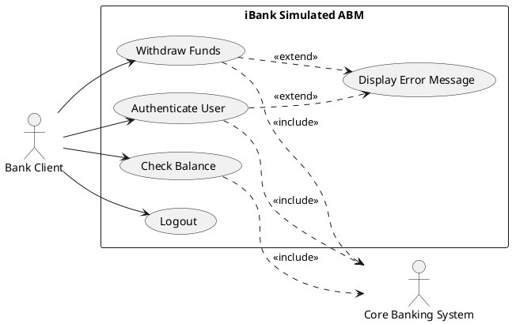

This document provides the foundational analysis for Delivery 1 (D1) of the iBank project. It is structured to serve as both a direct reference for your submission and a guide for your slide deck. 

***

### 1. Recommended ABM Concept & Scope

**Recommended Concept:** A "Simulated Standalone Retail ABM" (Automated Banking Machine). 
**Suitability for Canada:** This concept aligns with the Canadian retail banking landscape, where standalone ABMs in malls and grocery stores are ubiquitous. It respects Canadian bilingualism (English/French UI) and accessibility standards, while avoiding the legal complexities of operating a live, cash-handling physical machine.

**Deliberately Simple Scope:** 
To ensure successful implementation in D2 and robust measurement in D3, iBank will be restricted to a **simulated software-only environment**. 
*   **Included:** Manual GUI entry for card numbers, masked PIN entry, account balance inquiries, simulated cash withdrawals (updating an in-memory ledger), and session logout. 
*   **Excluded:** Real magnetic stripe/chip/NFC reading, physical cash dispensing, live Interac network routing, biometric authentication, cryptocurrency, fraud scoring, and physical hardware management. 

***

### 2. Slide-by-Slide Outline for D1

*   **Slide 1: Title Slide** (Project Name: iBank, Team Members, Course, Date)
*   **Slide 2: Project Scope & Vision** (Simulated Retail ABM, Java GUI focus, Agile/DevOps approach)
*   **Slide 3: Problem 1 - ABM Context** (Selected ABM type, primary users, supported transactions)
*   **Slide 4: Problem 1 - Canadian Legal & Assumptions** (PIPEDA, Accessibility, explicit project constraints)
*   **Slide 5: Problem 2 - GQM Goal** (SMART goal statement, perspective, and environment)
*   **Slide 6: Problem 2 - SMART Validation** (Table validating Specific, Measurable, Attainable, Realistic, Timely)
*   **Slide 7: Problem 2 - GQM Questions 1 to 3** (Complexity, Cohesion, Size metrics)
*   **Slide 8: Problem 2 - GQM Questions 4 to 6** (Coupling, Defect indicators, and Qualitative limitations)
*   **Slide 9: Problem 3 - Use Case Actors & Stories** (Actor definitions, user-story mapping)
*   **Slide 10: Problem 3 - Textual Use Case Model** (Main success scenarios and exceptions)
*   **Slide 11: Problem 3 - Graphical Use Case Diagram** (PlantUML/Mermaid visual)
*   **Slide 12: Future Deliverables Fit** (D2 Java implementation plan and D3 metric feasibility)
*   **Slide 13: GAI Use & References** (CASTROFF prompts used, citations, and verification notes)

***

### 3. Problem 1: ABM Selection and Context

*   **Selected ABM Type:** Simulated Standalone Retail ABM (Software Prototype).
*   **Brief Description:** A self-service software application simulating a physical ABM located in a Canadian retail environment. It allows users to authenticate via a simulated card/PIN and perform basic account ledger updates.
*   **Primary Users:** Bank clients (retail customers) and Bank Technicians (for simulated maintenance/login).
*   **Supported Transaction Categories:** Authentication, Account Inquiry (Balance), Simulated Cash Withdrawal, and Session Management (Logout).
*   **Canadian Context and Legal/Regulatory Assumptions:**
    *   *Privacy:* Assumes compliance with **PIPEDA** (Personal Information Protection and Electronic Documents Act) regarding the collection and display of personal financial data. (Note: As a simulation, no real PII is collected).
    *   *Accessibility:* Assumes UI design aligns with the **Accessible Canada Act (ACA)** and **CSA B651** guidelines (e.g., high contrast, scalable fonts, screen-reader compatibility in the Java GUI).
    *   *Language:* Assumes compliance with the **Official Languages Act**, requiring a functional English/French toggle in the UI.
*   **Explicit Project Assumptions:**
    *   The "card reader" is simulated via a standard text input field.
    *   The "cash dispenser" is simulated via a text output label and an in-memory account balance deduction.
    *   The backend core banking system is mocked using local Java data structures (e.g., `HashMap`).
    *   No real financial transactions or network calls to external APIs (like Interac) will occur.

***

### 4. Problem 2: GQM Approach and Metrics

#### GQM Goal Statement
*   **Purpose:** To *evaluate* the *iBank Java source code* in order to *improve* it.
*   **Perspective:** Examine *maintainability and structural complexity* from the viewpoint of the *student development team*.
*   **Environment:** In the context of *a 3-person agile team developing a simulated ABM GUI for a university software measurement course*.

#### SMART Check Table

| SMART Element | Evidence in the Goal | Possible Weakness |
| :--- | :--- | :--- |
| **Specific** | Focuses strictly on "maintainability and structural complexity" of the "iBank Java source code". | "Improve" is slightly broad; improvement will be defined by threshold targets in D3. |
| **Measurable** | Maintainability and complexity can be quantified using established static analysis metrics (e.g., WMC, LCOM). | Requires team to successfully configure static analysis tools (e.g., SonarQube, MetricsReloaded). |
| **Attainable** | A 3-student team can easily run static analysis on a small Java codebase. | Tool learning curve might consume early D2 sprint time. |
| **Realistic** | Code quality is highly relevant to a software measurement course and agile development. | None identified; aligns perfectly with course objectives. |
| **Timely** | Evaluation occurs during D3, following the D2 implementation phase. | Requires strict adherence to the D2 coding deadline to allow time for D3 measurement. |

#### 2N (6) GQM Questions and Metrics

*Note: A **measure** is a raw quantitative assessment (e.g., SLOC). A **metric** is a computed measure providing context (e.g., Defect Density). An **indicator** combines metrics for decision-making.*

| Q# | Question | Candidate Metric(s) | Obj/Subj | Entity | Attribute | Unit/Scale | Collection Method | Rationale (Why it helps) |
|:---|:---|:---|:---|:---|:---|:---|:---|:---|
| **1** | How complex are the individual transaction processing methods? | Cyclomatic Complexity (CC) | Objective | Method | Logical complexity | Integer (Count) | Static analysis tool (e.g., Checkstyle) | High CC indicates methods that are hard to test and maintain, directly answering the complexity question. |
| **2** | How cohesive are the core business logic classes? | Lack of Cohesion in Methods (LCOM*) | Objective | Class | Cohesion | Integer/Ratio | Static analysis tool | High LCOM* indicates a class doing too many unrelated things, highlighting poor maintainability. |
| **3** | What is the relative size of the UI module versus the business logic module? | Logical SLOC (Source Lines of Code) | Objective | Module | Size | Integer (Lines) | IDE line counter / Static tool | Helps ensure the UI isn't bloated with business logic (separation of concerns). |
| **4** | How tightly coupled are the GUI classes to the account database classes? | Coupling Factor (CF) or CBO | Objective | Class/ System | Coupling | Ratio / Integer | Static analysis tool | High coupling means UI changes might break backend logic, reducing maintainability. |
| **5** | What is the density of static code warnings in the codebase? | Warning Density (Warnings per 1000 SLOC) | Objective | System | Code quality | Ratio | Static analysis tool (e.g., SonarQube) | Acts as an indicator of potential technical debt and poor coding standards. |
| **6** | How intuitively can a new developer understand the transaction flow architecture? | Architecture Comprehension Score (1-5 Likert) | Subjective | System | Understandability | Ordinal Scale | Peer review survey / Questionnaire | Captures human perception of the code structure, which objective metrics often miss. |

#### Question Requiring More Than a Metric
**Question 6** cannot be answered well by a metric alone. 
*Reasoning:* A subjective score (e.g., an average of 3.2 out of 5) lacks context. It tells you *that* the architecture is somewhat difficult to understand, but not *why*. Relying solely on this metric could lead to metric misuse (e.g., assuming a low score means the code is "bad" without understanding the specific architectural bottlenecks). To properly answer Q6, the metric must be combined with qualitative evidence, such as think-aloud protocols, peer code-review comments, or architectural walkthroughs, to provide the necessary context for interpretation.

***

### 5. Problem 3: Use Case Model

#### Actor Definitions
*   **Bank Client (Primary):** The retail customer interacting with the ABM GUI to perform financial transactions.
*   **Core Banking System (Supporting):** The simulated backend system that validates PINs and updates account ledgers.

#### Use Case Definitions
*   **Authenticate User:** Verifies the client's simulated card number and PIN.
*   **Check Balance:** Retrieves and displays the current account balance.
*   **Withdraw Funds:** Deducts a specified amount from the account and simulates cash dispensing.
*   **Logout:** Securely ends the session and returns the UI to the welcome screen.

#### User-Story-First Table

| Use Case | User Story | Acceptance Notes for Prototype |
| :--- | :--- | :--- |
| **Authenticate User** | As a Bank Client, I want to log in with my card and PIN so that I can access my account. | UI must mask PIN entry. Must handle invalid PIN with an error message. |
| **Check Balance** | As a Bank Client, I want to view my balance so that I know how much money I have. | Balance must be formatted as CAD currency. |
| **Withdraw Funds** | As a Bank Client, I want to withdraw cash so that I have physical money. | Must prevent withdrawal if funds are insufficient. Must update backend ledger. |
| **Logout** | As a Bank Client, I want to log out so that my session is secured. | Must clear UI fields and disable transaction buttons upon completion. |

#### Textual Use Case Model Table

| Use Case | Primary Actor | Supporting Actor | Preconditions | Main Success Scenario | Exceptions | Postconditions |
| :--- | :--- | :--- | :--- | :--- | :--- | :--- |
| **Authenticate User** | Bank Client | Core Banking System | ABM is in idle state. | 1. Client enters card number. 2. Client enters PIN. 3. System validates via Backend. 4. System shows main menu. | Invalid PIN: System shows error, prompts retry. | Client is authenticated; session active. |
| **Check Balance** | Bank Client | Core Banking System | Client is authenticated. | 1. Client selects "Check Balance". 2. System requests balance from Backend. 3. System displays balance. | Backend timeout: System shows error. | Balance displayed; session remains active. |
| **Withdraw Funds** | Bank Client | Core Banking System | Client is authenticated. | 1. Client selects amount. 2. System verifies funds via Backend. 3. Backend deducts funds. 4. System simulates dispensing. | Insufficient funds: System shows error, aborts. | Account deducted; simulated cash dispensed. |
| **Logout** | Bank Client | None | Client is authenticated. | 1. Client selects "Logout". 2. System clears session data. 3. System shows idle screen. | None. | Session terminated; ABM returns to idle. |

#### Graphical Use Case Diagram (PlantUML)

#### Relationship Notes
*   **`<<include>>`**: The `Check Balance` and `Withdraw Funds` use cases *include* the `Core Banking System` because the backend must be queried to retrieve or modify the ledger. (Note: Authentication also includes backend validation).
*   **`<<extend>>`**: `Display Error Message` *extends* `Authenticate User` and `Withdraw Funds`. The error display is an exceptional flow that only occurs under specific conditions (e.g., wrong PIN, insufficient funds), keeping the main success scenario clean.

***

### 6. Future Deliverables Fit

*   **Java GUI Implementation:** The scope is perfectly sized for a 3-student team using Java Swing or JavaFX. The separation of the simulated hardware (card reader/cash dispenser) from the UI logic allows the team to use standard MVC (Model-View-Controller) patterns without getting bogged down in hardware APIs.
*   **Anticipated D2 Classes:** 
    *   `ABMMainFrame` (View)
    *   `CardReaderSimulator` (Hardware Mock)
    *   `AccountManager` (Model/Service)
    *   `TransactionProcessor` (Controller)
*   **Support for D3 Metrics:** 
    *   *SLOC & Readability:* The distinct MVC classes will provide clear boundaries for Logical SLOC counting.
    *   *Cyclomatic Complexity:* `TransactionProcessor` will contain `if/else` logic for insufficient funds and PIN retries, generating measurable CC.
    *   *WMC & LCOM*:* `AccountManager` will have multiple methods (getBalance, deductFunds), allowing for meaningful Weighted Methods per Class and Lack of Cohesion measurements.
    *   *CF (Coupling Factor):* The team can measure how well they isolated the `ABMMainFrame` from the `AccountManager`. High coupling here would indicate poor MVC separation.
    *   *UCP (Use Case Points):* The 4 distinct use cases with 2 actors provide a sufficient, non-trivial baseline for UCP calculation without overwhelming the team with environmental complexity factors.

***

### 7. GAI Use Explanation

#### CASTROFF Prompts Used for Generation
To ensure rigorous, structured, and context-aware outputs, the following CASTROFF-based prompts were designed and executed using a publicly available LLM (e.g., Qwen/GPT-4) for each problem:

*   **Problem 1 Prompt:** *(Constraints)* No real hardware, must be legal in Canada. *(Audience)* University grading TA. *(Structure)* Bullet points covering type, users, transactions, legal. *(Tone)* Academic and precise. *(Role)* Requirements Analyst. *(Output)* Markdown list. *(Focus)* Simulated ABM context. *(Function)* Define D1 project scope.
*   **Problem 2 Prompt:** *(Constraints)* Exactly 6 questions, use SMART template strictly. *(Audience)* Software Measurement Professor. *(Structure)* Tables for SMART check and Metrics. *(Tone)* Analytical. *(Role)* Measurement Analyst. *(Output)* Markdown tables. *(Focus)* GQM, code metrics, metric limitations. *(Function)* Establish D3 measurement baseline.
*   **Problem 3 Prompt:** *(Constraints)* Max 4 use cases, simple actors. *(Audience)* Development team. *(Structure)* User story table, textual table, PlantUML. *(Tone)* Technical and concise. *(Role)* Systems Analyst. *(Output)* Markdown and PlantUML code block. *(Focus)* UML use case modeling. *(Function)* Define D2 functional requirements.

#### Review and Modification Before Submission
*   **Review:** The team must verify that the PlantUML syntax renders correctly in their specific diagramming tool (e.g., PlantText or IDE plugin). 
*   **Modify:** Adjust the "Anticipated D2 Classes" in the Future Fit section if the team decides to use a different architectural pattern (e.g., MVP instead of MVC). Ensure the GQM goal aligns with the team's actual D3 grading rubric.

#### External Citation and Verification Needs
*   The LLM generated the structural and conceptual content based on standard software engineering principles. 
*   **Verification required:** The team must verify the exact legal names and current status of Canadian acts (e.g., PIPEDA, Accessible Canada Act) via official government sources (`.gc.ca`), as LLMs can occasionally hallucinate specific legal clause numbers. No verbatim text was copied from external sources; all concepts are paraphrased.

***

### 8. Potential References To Verify

*Do not copy these directly into your bibliography without verifying the exact publication year, edition, and publisher details from your university library or official sources.*

**Canadian Banking, Privacy, and Accessibility Regulation:**
*   Office of the Privacy Commissioner of Canada (OPC). *Personal Information Protection and Electronic Documents Act (PIPEDA)*. (Verify current consolidated version on laws-lois.justice.gc.ca).
*   Government of Canada. *Accessible Canada Act (ACA)*. (Verify statutory details regarding digital accessibility).
*   Canadian Standards Association (CSA). *CSA B651: Accessible design for the built environment* (Check for sections applicable to digital UI/kiosks).

**Software Measurement and GQM Literature:**
*   Basili, V. R., Caldiera, G., & Rombach, H. D. (1994). *The Goal Question Metric Approach*. Encyclopedia of Software Engineering. (Foundational text for GQM).
*   Fenton, N., & Bieman, J. M. (2014). *Software Metrics: A Rigorous and Practical Approach*. CRC Press. (For definitions of measure, metric, indicator, and LCOM/Coupling).
*   ISO/IEC 25010:2011 (or newer 2023 revision). *Systems and software engineering — Systems and software Quality Requirements and Evaluation (SQuaRE)*. (For maintainability and complexity quality characteristics).

**UML and Use Case Modeling:**
*   Booch, G., Rumbaugh, J., & Jacobson, I. (2005). *The Unified Modeling Language User Guide*. Addison-Wesley. (For standard UML use case relationship definitions like include/extend).
*   Cockburn, A. (2000). *Writing Effective Use Cases*. Addison-Wesley. (For the textual use case template and main success/exception flows).
