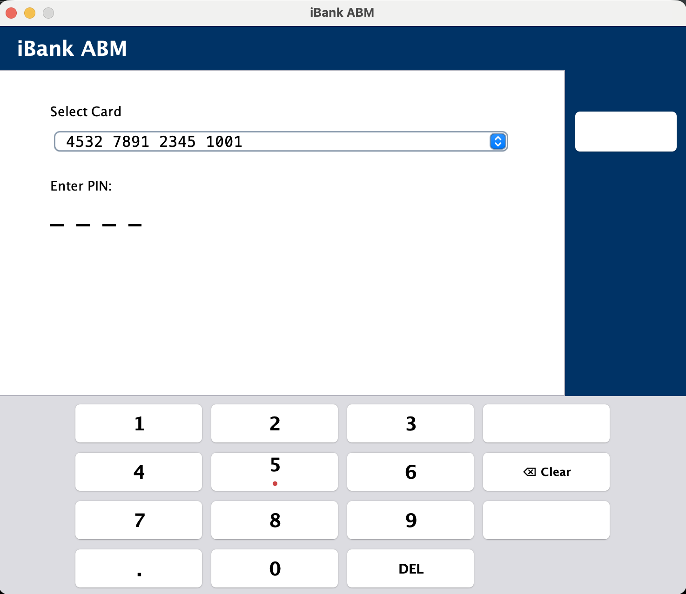

# iBank ABM System

A Java-based Automated Banking Machine (ABM) application developed for **SOEN 6611 – Deliverable 2**.

The application follows the **Model–View–Controller (MVC)** architectural pattern and provides a graphical user interface for customers, administrators, and technicians. Customer information and transaction data are persisted using an SQLite database.

---

## Table of Contents

* [Overview](#overview)
* [Features](#features)
* [Technologies](#technologies)
* [Project Structure](#project-structure)
* [Application Screenshot](#application-screenshot)
* [Requirements](#requirements)
* [Running the Application](#running-the-application)
* [Running the Tests](#running-the-tests)
* [External Libraries](#external-libraries)
* [Design Documentation](#design-documentation)
* [Authors](#authors)

---

## Overview

The iBank ABM System simulates the functionality of a real-world Automated Banking Machine (ABM). The project was implemented in Java using Swing for the graphical user interface and follows the MVC software architecture to improve maintainability and modularity.

The system supports customer banking operations, administrator management functions, technician maintenance functions, multilingual user interfaces, and persistent storage through SQLite.

---

## Features

* Customer authentication using card number and PIN
* Cash withdrawal
* Cash deposit
* Money transfer between accounts
* Transaction history
* Administrator account management
* Technician cash refill
* Exchange rate management
* Multi-language interface (English, French, and Chinese)
* SQLite database persistence

---

## Technologies

* Java
* Java Swing
* SQLite
* JDBC
* JUnit 4
* MVC Architecture

---

## Project Structure

```text
d2/
├── bin/                  # Compiled classes
├── eval/                 # Evaluation files and reports
├── images/               # Images used in README
├── lib/                  # External libraries
├── src/                  # Application source code
├── test/                 # Unit and integration tests
├── iBank.db              # SQLite database
├── README.md
├── run.sh
├── run_macos.sh
├── run_windows.bat
├── test.sh
├── test_macos.sh
├── test_windows.bat
└── software_design.md
```

---

## Application Screenshot

The following figure illustrates the login interface of the iBank ABM System.

<p align="center">
  
</p>

---

## Requirements

Before running the project, ensure the following software is installed:

* Java JDK 17 or later

Verify your installation:

```bash
java -version
javac -version
```

---

## Running the Application

### macOS

```bash
chmod +x run_macos.sh
./run_macos.sh
```

### Linux

```bash
chmod +x run.sh
./run.sh
```

### Windows

```cmd
run_windows.bat
```

The provided scripts automatically compile the source code, copy required resources, and launch the application.

---

## Running the Tests

### macOS

```bash
chmod +x test_macos.sh
./test_macos.sh
```

### Linux

```bash
chmod +x test.sh
./test.sh
```

### Windows

```cmd
test_windows.bat
```

The test scripts compile the application and execute the JUnit test suite.

---

## External Libraries

The project uses the following libraries located in the `lib/` directory:

* SQLite JDBC Driver
* SLF4J API
* SLF4J NOP
* JUnit 4.13.2
* Hamcrest 2.2

No additional dependency installation is required.

---

## Design Documentation

The software architecture and design documentation is available in:

```
software_design.md
```

The document includes:

* Software architecture
* MVC architecture
* Package organization
* Class design
* Design rationale
* Architectural decisions

---

## Authors

SOEN 6611 Project Team

Course: **SOEN 6611 – Software Engineering**
