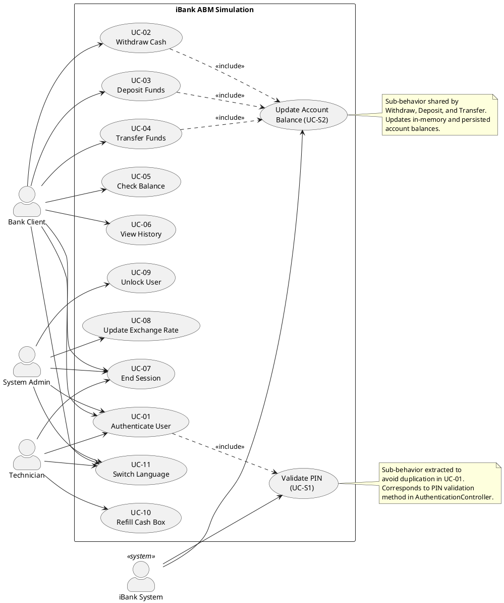
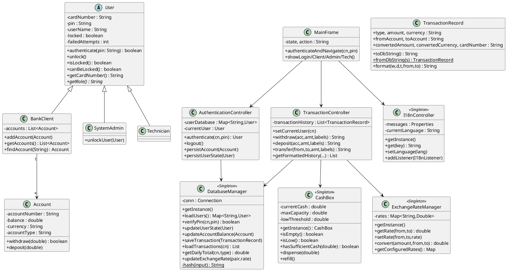
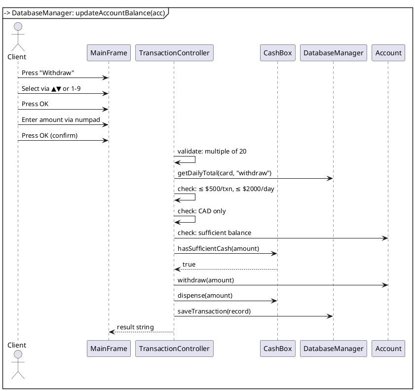
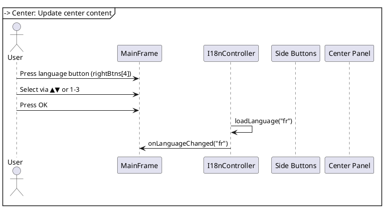
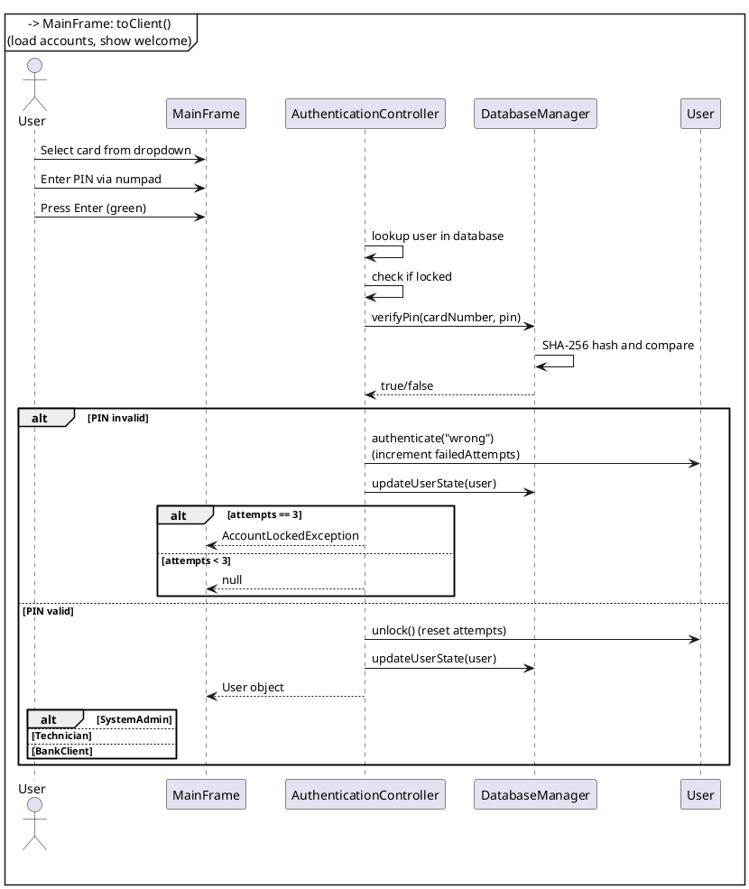
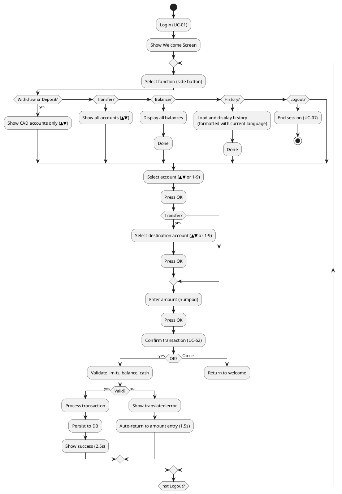
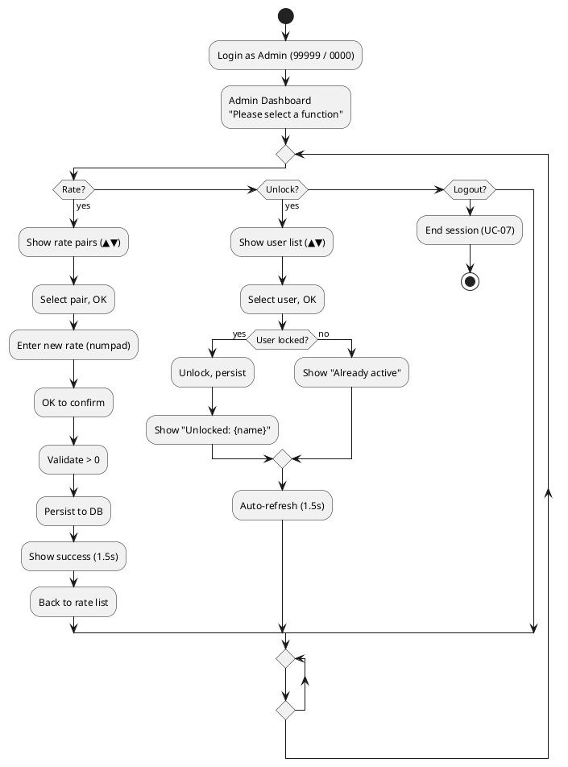
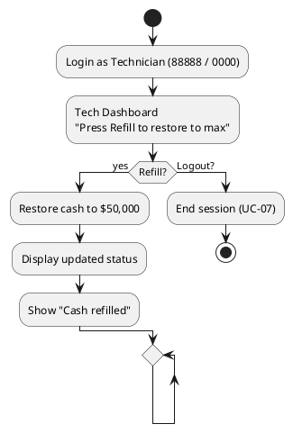

# iBank ABM — D2 Software Design Document

> **Course:** SOEN 6611 — Software Measurement  
> **Team:** Group C  
> **Date:** 2026-06-23  

---

## 1. Architecture Overview

The iBank application follows the **Model-View-Controller (MVC)** pattern with a **Singleton-based service layer** for shared state. The architecture uses **Java Swing** for the UI and **SQLite** via JDBC for persistence.

```
┌────────────────────────────────────────┐
│              MainFrame (View+Router)    │
│  ┌──────────┐  ┌──────────────┐        │
│  │ SideBtns │  │ Center Panel │        │
│  │ (L/R)    │  │ (CardLayout) │        │
│  └──────────┘  └──────────────┘        │
│  ┌──────────────────────────────┐      │
│  │       Numpad (Keypad)        │      │
│  └──────────────────────────────┘      │
└────────────┬───────────────────────────┘
             │
    ┌────────┴────────┐
    │   Controllers   │
    │  AuthCtrl       │
    │  TxnCtrl        │
    │  I18nCtrl       │
    └────────┬────────┘
             │
    ┌────────┴────────┐
    │     Models      │
    │  User/Account   │
    │  CashBox        │
    │  ExchangeRate   │
    │  Database       │
    └────────┬────────┘
             │
    ┌────────┴────────┐
    │   SQLite DB     │
    │  (~/.ibank.db)  │
    └─────────────────┘
```

---

## 2. Use Case Model

### 2.1 Actors

| Actor | Type | Description |
|-------|------|-------------|
| **Bank Client** | Primary (human) | A registered bank customer who holds one or more accounts. Initiates all ABM transactions via the graphical interface. |
| **System Administrator** | Primary (human) | Manages exchange rates and unlocks client accounts locked due to excessive failed PIN attempts. |
| **Technician** | Primary (human) | Responsible for physical cash box maintenance — refills cash to maximum capacity. |
| **iBank System** | Supporting (system) | Internal ABM software. Validates credentials, enforces business rules, updates balances, persists data, and manages language localization. |

### 2.2 Use Case Diagram (PlantUML)



### 2.3 Use Case Definitions

#### UC-01 — Authenticate User

| Field | Detail |
|-------|--------|
| **Primary Actor** | Bank Client, System Admin, Technician |
| **Supporting Actor** | iBank System |
| **Preconditions** | Application is running; login screen is displayed with card dropdown and numpad visible. |
| **Main Success Scenario** | 1. User selects card number from dropdown. 2. User enters 4-digit PIN via soft keypad. 3. User presses Enter (green). 4. System validates credentials against SHA-256 hashed PIN in database. 5. System checks lock status — if locked, rejects. 6. System loads user data (accounts for client, empty for admin/tech). 7. System displays role-appropriate dashboard. |
| **Exceptions** | E1: Invalid PIN — system displays error, increments failed attempt counter. After 3 consecutive failures, BankClient accounts lock (Admins/Techs are immune). E2: Account already locked — system displays "Account is locked" error. E3: Invalid card number — system displays "Invalid card number" error. |
| **Postconditions** | User is authenticated. Session is active. Side buttons and center content reflect user role. |

#### UC-02 — Withdraw Cash

| Field | Detail |
|-------|--------|
| **Primary Actor** | Bank Client |
| **Supporting Actor** | iBank System |
| **Preconditions** | UC-01 completed as Bank Client. At least one CAD account exists. Cash box has sufficient funds. |
| **Main Success Scenario** | 1. Client presses "Withdraw" side button. 2. System shows only CAD accounts with ▲▼ navigation. 3. Client selects account (▲▼ or number key) and presses OK. 4. System prompts for amount. 5. Client enters amount via numpad (must be multiple of $20). 6. Client presses OK. 7. System validates: amount ≤ $500 per transaction, within $2000 daily limit, ≤ account balance, ≤ cash box funds. 8. System deducts from account and cash box. 9. System persists updated balance and transaction record. 10. System displays success message. |
| **Exceptions** | E1: Amount not multiple of $20 — "Amount must be a multiple of 20". E2: Amount > $500 — "Maximum withdrawal per transaction: $500". E3: Daily limit exceeded — "Daily withdrawal limit reached: $2,000". E4: Insufficient account balance. E5: Cash box has insufficient funds. E6: Non-CAD account selected — "Only CAD accounts can be withdrawn". E7: Client cancels — returns to welcome screen. |
| **Postconditions** | Account balance decreased. Cash box decreased. Transaction persisted to DB. |

#### UC-03 — Deposit Funds

| Field | Detail |
|-------|--------|
| **Primary Actor** | Bank Client |
| **Supporting Actor** | iBank System |
| **Preconditions** | UC-01 completed as Bank Client. At least one CAD account exists. |
| **Main Success Scenario** | 1. Client presses "Deposit" side button. 2. System shows only CAD accounts with ▲▼ navigation. 3. Client selects account and presses OK. 4. System prompts for amount. 5. Client enters amount via numpad (must be multiple of $20). 6. Client presses OK. 7. System validates: amount ≤ $2000 per transaction, within $5000 daily limit. 8. System credits account. 9. System persists updated balance and transaction record. 10. System displays success message. |
| **Exceptions** | E1: Amount not multiple of $20. E2: Amount > $2000 — "Maximum deposit per transaction: $2,000". E3: Daily limit exceeded — "Daily deposit limit reached: $5,000". E4: Non-CAD account selected. E5: Client cancels. |
| **Postconditions** | Account balance increased. Transaction persisted to DB. |

#### UC-04 — Transfer Funds

| Field | Detail |
|-------|--------|
| **Primary Actor** | Bank Client |
| **Supporting Actor** | iBank System |
| **Preconditions** | UC-01 completed as Bank Client. At least two accounts exist (one source, one destination). |
| **Main Success Scenario** | 1. Client presses "Transfer" side button. 2. System shows all accounts with ▲▼ navigation. 3. Client selects source account and presses OK. 4. System shows destination accounts (excluding source). 5. Client selects destination and presses OK. 6. Client enters amount via numpad. 7. Client presses OK. 8. System validates: amount > 0, sufficient balance. 9. If currencies differ: system auto-converts using current exchange rate. 10. System debits source, credits destination (converted if needed). 11. System persists both balances and transaction record. 12. System displays success message with conversion details. |
| **Exceptions** | E1: Insufficient source balance. E2: Amount ≤ 0 — "Amount must be positive". E3: Same source and destination — "Source and destination are the same". E4: Client cancels. |
| **Postconditions** | Source balance decreased. Destination balance increased (possibly by converted amount). Transaction persisted to DB. |

#### UC-05 — Check Balance

| Field | Detail |
|-------|--------|
| **Primary Actor** | Bank Client |
| **Supporting Actor** | iBank System |
| **Preconditions** | UC-01 completed as Bank Client. |
| **Main Success Scenario** | 1. Client presses "Balance" side button. 2. System displays all accounts with account number, type, balance, and currency. |
| **Exceptions** | None — read-only operation. |
| **Postconditions** | No account state changed. |

#### UC-06 — View Transaction History

| Field | Detail |
|-------|--------|
| **Primary Actor** | Bank Client |
| **Supporting Actor** | iBank System |
| **Preconditions** | UC-01 completed as Bank Client. |
| **Main Success Scenario** | 1. Client presses "History" side button. 2. System loads transactions from DB filtered by current user's card number. 3. System formats each transaction with current language labels (withdraw/deposit/transfer) and prepositions (from/to). 4. System displays formatted history list. |
| **Exceptions** | E1: No transactions found — "No transactions yet." |
| **Postconditions** | No account state changed. History visible in center. |

#### UC-07 — End Session (Logout)

| Field | Detail |
|-------|--------|
| **Primary Actor** | Bank Client, System Admin, Technician |
| **Supporting Actor** | iBank System |
| **Preconditions** | Any authenticated session. |
| **Main Success Scenario** | 1. User presses "Logout" side button. 2. System clears session state. 3. System clears transaction history for current user. 4. System resets sidebar colors to default. 5. System returns to login screen. |
| **Exceptions** | None. |
| **Postconditions** | No authenticated user. Login screen displayed. |

#### UC-08 — Update Exchange Rate

| Field | Detail |
|-------|--------|
| **Primary Actor** | System Admin |
| **Supporting Actor** | iBank System |
| **Preconditions** | UC-01 completed as System Admin. |
| **Main Success Scenario** | 1. Admin presses "Rate" side button. 2. System shows all configured currency pairs with current rates and ▲▼ navigation. 3. Admin selects a pair (▲▼ or number key) and presses OK. 4. System shows current rate and prompts for new rate. 5. Admin enters new rate via numpad (must be > 0). 6. Admin presses OK. 7. System updates rate in memory and persists to DB. 8. System displays success message. |
| **Exceptions** | E1: No rate selected — prompt to select. E2: Rate ≤ 0 — "Must be > 0". E3: Invalid number format. E4: Admin cancels — returns to rate list. |
| **Postconditions** | Exchange rate updated in memory and persisted to DB. |

#### UC-09 — Unlock User

| Field | Detail |
|-------|--------|
| **Primary Actor** | System Admin |
| **Supporting Actor** | iBank System |
| **Preconditions** | UC-01 completed as System Admin. |
| **Main Success Scenario** | 1. Admin presses "Unlock" side button. 2. System shows all BankClient users with card number, name, and lock status (Locked/Active). 3. Admin navigates with ▲▼ or number keys, selects a locked user, and presses OK. 4. System unlocks user (resets locked flag and failed attempt counter). 5. System persists unlock state to DB. 6. System displays "Unlocked: {userName}". 7. System auto-refreshes user list after 1.5s. |
| **Exceptions** | E1: No user selected — prompt to select. E2: User not locked — "Already active". E3: Admin cancels — returns to dashboard. |
| **Postconditions** | Selected user unlocked. Lock state persisted to DB. |

#### UC-10 — Refill Cash Box

| Field | Detail |
|-------|--------|
| **Primary Actor** | Technician |
| **Supporting Actor** | iBank System |
| **Preconditions** | UC-01 completed as Technician. |
| **Main Success Scenario** | 1. Tech presses "Refill" side button. 2. System restores cash box to maximum capacity ($50,000). 3. System displays updated cash status (level, max, threshold, status). 4. System shows "Cash refilled" success message. |
| **Exceptions** | None. |
| **Postconditions** | Cash box set to maximum capacity ($50,000). Withdrawals unblocked if previously blocked. |

#### UC-11 — Switch Language

| Field | Detail |
|-------|--------|
| **Primary Actor** | All (Client, Admin, Tech) |
| **Supporting Actor** | iBank System |
| **Preconditions** | Application is running. |
| **Main Success Scenario** | 1. User presses language button (right side, shows current language code). 2. System shows language list: 1=English, 2=Français, 3=中文. 3. User selects via ▲▼ or number keys and presses OK. 4. System loads new language properties file. 5. System updates all visible text: side buttons, keypad labels, center titles, prompts, error messages, table headers, navigation instructions. 6. System preserves current screen state. 7. System returns to previous screen. |
| **Exceptions** | E1: User cancels — returns to previous screen unchanged. |
| **Postconditions** | All UI text rendered in selected language. Current screen preserved. |

### 2.4 User Stories

| ID | Use Case | User Story | Acceptance Criteria |
|----|----------|-----------|-------------------|
| US-01 | UC-01 | As a bank client, I want to authenticate with my card and PIN so that I can access my accounts securely. | Correct PIN grants access. 3 wrong PINs lock BankClient accounts (Admins/Techs immune). Lock persists across restarts. |
| US-02 | UC-02 | As a bank client, I want to withdraw CAD cash from my chequing or savings account. | Amount must be multiple of $20, max $500/transaction, max $2000/day. Only CAD accounts shown. |
| US-03 | UC-03 | As a bank client, I want to deposit CAD cash into my account. | Amount must be multiple of $20, max $2000/transaction, max $5000/day. Only CAD accounts shown. |
| US-04 | UC-04 | As a bank client, I want to transfer funds between my accounts, including cross-currency. | Multi-currency auto-converts using current exchange rate. Balances persisted. |
| US-05 | UC-05 | As a bank client, I want to check my account balances. | All accounts displayed with account number, type, balance, and currency. |
| US-06 | UC-06 | As a bank client, I want to view my past transactions. | Only my transactions shown. Labels and prepositions change with language. |
| US-07 | UC-07 | As any user, I want to end my session to protect my account. | Session cleared. Returns to login screen. |
| US-08 | UC-08 | As an admin, I want to update currency exchange rates. | Select pair, enter new rate, persisted to DB. |
| US-09 | UC-09 | As an admin, I want to unlock clients locked by failed PIN attempts. | Select locked user, unlock, persist. |
| US-10 | UC-10 | As a technician, I want to refill the cash box so clients can withdraw. | Single press restores to $50,000 max. |
| US-11 | UC-11 | As any user, I want to switch the interface language. | EN/FR/ZH available. Current screen preserved during switch. |

### 2.5 Include/Extend/Generalization Relationships

| Relationship | From | To | Rationale |
|-------------|------|----|-----------|
| **<<include>>** | UC-01 (Authenticate) | UC-S1 (Validate PIN) | PIN validation is a mandatory sub-step of every authentication. |
| **<<include>>** | UC-02 (Withdraw) | UC-S2 (Update Balance) | All monetary operations share the balance update mechanism. |
| **<<include>>** | UC-03 (Deposit) | UC-S2 (Update Balance) | |
| **<<include>>** | UC-04 (Transfer) | UC-S2 (Update Balance) | |

No generalization relationships used — actors are distinct enough that inheritance is unwarranted. No extend relationships — the feature set is simple with no optional extension points.

---

## 3. Class Diagram (PlantUML)



---

## 4. Sequence Diagrams

### 4.1 Withdraw Cash (UC-02)



### 4.2 Switch Language (UC-11)



### 4.3 Authenticate User (UC-01)



---

## 5. Activity Diagrams

### 5.1 Client Transaction Flow



### 5.2 Admin Flow



### 5.3 Technician Flow



---

## 6. Database Schema

```sql
CREATE TABLE users (
    card_number TEXT PRIMARY KEY,     -- '10001','10002','99999','88888'
    pin_hash TEXT NOT NULL,           -- SHA-256 hexadecimal
    user_name TEXT NOT NULL,
    role TEXT NOT NULL,               -- 'BankClient','SystemAdmin','Technician'
    locked INTEGER DEFAULT 0,
    failed_attempts INTEGER DEFAULT 0
);

CREATE TABLE accounts (
    account_number TEXT PRIMARY KEY,  -- 7-digit format (e.g. '1000101')
    card_number TEXT NOT NULL,
    balance REAL NOT NULL,
    currency TEXT NOT NULL,           -- 'CAD','USD','EUR'
    account_type TEXT NOT NULL,       -- 'chequing','savings'
    FOREIGN KEY(card_number) REFERENCES users(card_number)
);

CREATE TABLE exchange_rates (
    pair TEXT PRIMARY KEY,            -- 'CAD:USD'
    rate REAL NOT NULL
);

CREATE TABLE transactions (
    id INTEGER PRIMARY KEY AUTOINCREMENT,
    card_number TEXT NOT NULL,
    record TEXT NOT NULL,             -- pipe-delimited structured data
    created_at TEXT NOT NULL          -- ISO 8601 datetime
);
```

**Transaction record format** (pipe-delimited):
```
type|amount|currency|fromAccount|toAccount|convertedAmount|convertedCurrency|cardNumber
```

Example:
```
withdraw|100.0|CAD|1000101||0||10001
transfer|50.0|CAD|1000101|1000102|36.5|USD|10001
```

---

## 7. Business Rules

| Rule | Value | Applies To |
|------|-------|-----------|
| PIN max attempts before lockout (Clients only) | 3 | UC-01 |
| Withdrawal must be multiple of | $20 | UC-02 |
| Max withdrawal per transaction | $500 | UC-02 |
| Max withdrawal per day | $2,000 | UC-02 |
| Max deposit per transaction | $2,000 | UC-03 |
| Max deposit per day | $5,000 | UC-03 |
| Withdrawal/Deposit currency restriction | CAD only | UC-02, UC-03 |
| Cash box max capacity | $50,000 | UC-10 |
| Cash box low threshold | $1,000 | UC-02 |
| Account number format | 7 digits | All accounts |
| PIN storage | SHA-256 hashed | UC-01 |

---

## 8. Key Design Decisions

| Decision | Rationale |
|----------|-----------|
| **Singleton controllers** (ExchangeRateManager, I18nController, DatabaseManager, CashBox) | Global shared state; single source of truth |
| **Single-screen CardLayout** | Authentic ABM kiosk feel; no form-to-form navigation |
| **Side buttons (5 per panel) as primary input** | Prevents button overwriting; matches physical ABM layout |
| **Observer pattern for I18n** | Views register as listeners; update text on language change without state loss |
| **TransactionRecord for persistence** | Structured data stored as pipe-delimited strings; formatted at display time with i18n labels |
| **SHA-256 PIN hashing** | PINs never stored in plaintext; hash comparison at authentication |
| **Soft keypad with tactile symbols** | Canadian accessibility compliance: X/Cancel (red), ⌫/Clear (yellow), ◯/Enter (green), raised dot on 5 |
| **Per-user transaction history** | Filtered by card_number; Bob cannot see Alice's history |
| **Daily limits via created_at timestamp** | Proper per-calendar-day enforcement using SQLite LIKE filter |
| **DB path: ~/.ibank.db** | Consistent location regardless of working directory |

---

## 9. External Dependencies

| Library | File | Purpose |
|---------|------|---------|
| SQLite JDBC | `lib/sqlite-jdbc-3.45.1.0.jar` | SQLite database access |
| SLF4J API | `lib/slf4j-api-1.7.36.jar` | Logging facade (SQLite JDBC dependency) |
| SLF4J NOP | `lib/slf4j-nop-1.7.36.jar` | No-op logger |

---

## 10. Test Summary

| Category | File | Tests | Covers |
|----------|------|-------|--------|
| Unit | `test/ModelTests.java` | 24 | User auth, Account ops, CashBox, ExchangeRate, TransactionRecord, PIN hashing, roles |
| Integration | `test/IntegrationTests.java` | 22 | Auth flow, withdraw/deposit/transfer validation, daily limits, cross-currency, per-user history, persistence, cash box, lockout |

Run: `./d2/test.sh`

---

*End of Design Document*
