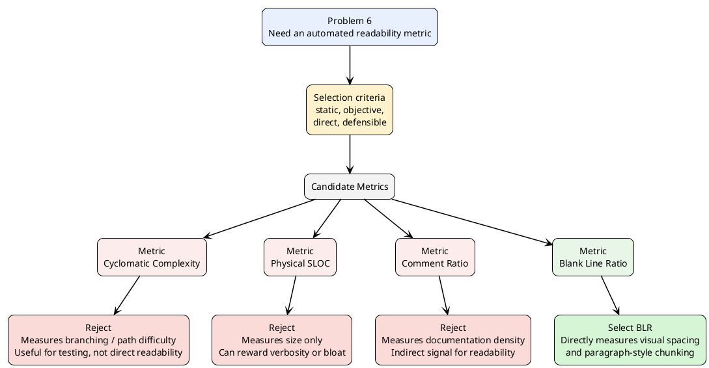
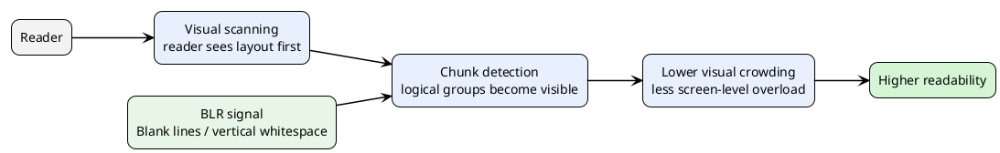

# Problem 6 - Why We Choose BLR as the Readability Metric

## Objective

Evaluate **codebase readability** in a development environment with:

- no external human participants
- a need for an **automated**, **objective**, and **static** evaluation method

The project requirement is not just to find *any* code metric, but to choose a metric that is most defensible as a **readability** metric under these constraints.

---

## 1. Candidate Selection Logic

The decision is not:

> "BLR is a nice metric, so we use it."

Instead, the decision is:

> "Among the candidate metrics that can be automatically computed without human studies, BLR is the one that most directly measures visual readability rather than testing difficulty, code volume, or maintainability."

### Decision Diagram

---

## 2. Why BLR and Not the Other Metrics?

### Core reasoning

The key distinction is the following:

- **CC** and **PSLOC** describe how the code is structured computationally.
- **CR** describes how much explanatory text surrounds the code.
- **BLR** describes how the code is **visually organized for a reader**.

Since the goal is **readability**, not testability, not maintainability in general, and not code size, the selected metric should be the one that is **closest to what a reader actually sees first** when scanning the source file.

That makes **vertical whitespace** the strongest direct proxy among the available candidates.

---

## 3. Comparison Matrix

| Metric | What it actually measures | Why it is useful | Why it is not the best primary readability metric |
|---|---|---|---|
| **Cyclomatic Complexity (CC)** | Number of independent decision paths | Good for testing effort, control-flow complexity, and path coverage | A file can have low CC but still be visually cluttered and hard to read. CC focuses on logic branching, not reading comfort. |
| **Physical SLOC (PSLOC)** | Raw code size / number of physical code lines | Good for size estimation and volume comparison | A larger file is not necessarily less readable, and a verbose style may increase PSLOC while improving clarity. PSLOC does not capture layout quality. |
| **Comment Ratio (CR)** | Amount of comments relative to code | Helpful for documentation and maintainability | More comments do not automatically mean more readable code. Excess comments can even signal unclear code. CR measures explanation density, not visual readability itself. |
| **Blank Line Ratio (BLR)** | Amount of vertical whitespace relative to total lines | Captures code paragraphing and visual separation of logical chunks | Most directly tied to visual readability and screen-level legibility; also easy to measure objectively and automatically. |

---

## 4. Stronger Selection Argument

To answer the TA's concern, the real justification is not just that BLR is "supported by literature".

The stronger argument is:

### Step 1: Define what readability means in this problem

Because no human experiment is allowed, readability must be approximated by a **static visual property of code**.

### Step 2: Separate direct indicators from indirect indicators

- **Direct visual indicator**: how the source text is spaced and chunked on screen
- **Indirect indicators**: complexity, volume, amount of documentation

### Step 3: Prefer the metric with the shortest conceptual distance to readability

Among the candidates:

- CC is two steps away from readability:
  - branch complexity -> reasoning difficulty -> maybe readability
- PSLOC is also two steps away:
  - file size -> density/verbosity -> maybe readability
- CR is one and a half steps away:
  - more comments -> more explanation -> maybe readability
- BLR is the closest:
  - vertical whitespace -> visual grouping -> readability

Therefore, **BLR is chosen because it is the most direct operationalization of visual readability among the available metrics**.

---

## 5. Visual Interpretation Model

This is the exact point where BLR is stronger than CC, PSLOC, and CR:

- BLR acts on the **reader's visual parsing stage**.
- The others act on secondary properties of code.

---

## 6. Literature and Standards Support

### Research support

Empirical software engineering work, including the readability framework of **Buse & Weimer (2010)** and related studies such as **Binkley et al.**, shows that layout features contribute measurably to human judgments of readability.

In particular, **blank lines and vertical whitespace** help readers segment source code into meaningful regions, much like paragraph breaks in ordinary prose.

### Industry support

Major style standards such as:

- **Google C++ Style Guide**
- **PEP 8**

explicitly require vertical whitespace to separate logical sections of code.

This matters because it means BLR is not just an academic intuition; it is also an **industry-recognized, enforceable coding-style rule**.

---

## 7. Final Selection Statement

You can say this on the slide or in the report:

> We evaluated four automated candidates for readability assessment: Cyclomatic Complexity, Physical SLOC, Comment Ratio, and Blank Line Ratio. We rejected CC because it primarily measures path complexity for testing, PSLOC because it measures code volume rather than readability, and Comment Ratio because it reflects documentation density more than visual legibility. We selected **Blank Line Ratio (BLR)** because it is the most direct static proxy for visual readability: it measures how well the code is partitioned into visually separable chunks, a property strongly supported by readability research and widely enforced by industrial style guides.

---

## 8. Slide Compression Version

If you need a shorter version for slides:

### Why BLR?

- **CC** -> measures branching complexity, not readability
- **PSLOC** -> measures size, not visual clarity
- **CR** -> measures documentation density, not direct readability
- **BLR** -> directly measures vertical whitespace and visual grouping

### Selection principle

> Choose the metric with the shortest conceptual distance to readability.

### Decision

> BLR is the best automated proxy because readability begins with how code is visually segmented on screen.

---

## 9. Suggested Slide Structure

If you want to spread this over multiple slides:

1. **Problem setup**
   - automated readability metric needed
   - no human experiment allowed

2. **Candidate metrics**
   - CC, PSLOC, CR, BLR

3. **Comparison slide**
   - one-row-per-metric comparison table

4. **Decision slide**
   - Mermaid decision diagram
   - final statement: BLR is most direct proxy

5. **Support slide**
   - Buse & Weimer, Binkley et al.
   - Google C++ Style Guide, PEP 8
