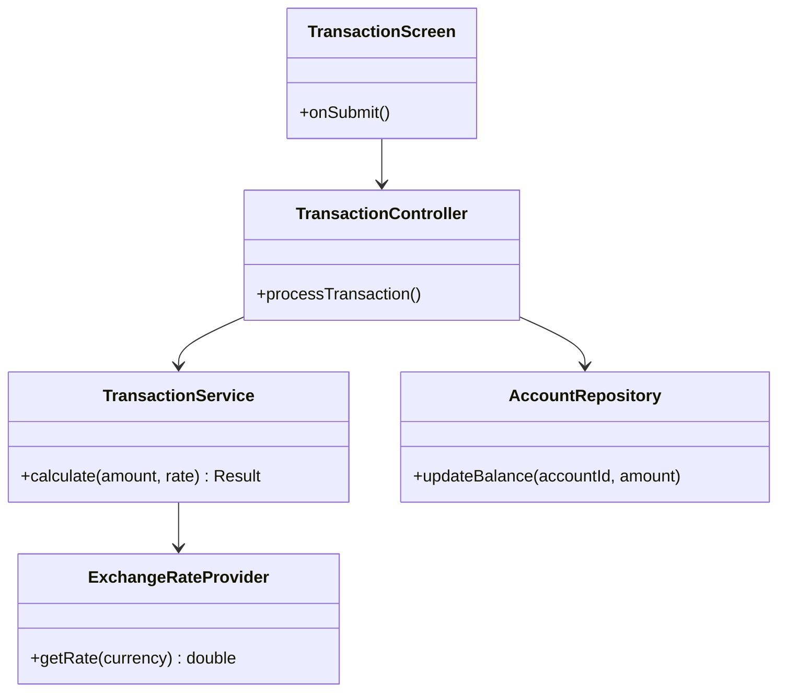

## Diagnosis: Current Design Strengths

The MVC-like separation already buys you testability and a clean mental model: GUI screens shouldn't contain business rules, and SQLite calls shouldn't live inside Swing event handlers. Having three distinct roles (client, administrator, technician) baked into the domain is a good sign — it means your access-control logic has somewhere natural to live (rather than being scattered `if` checks). For a student-scoped ABM simulator, this is a reasonable foundation; the issues below are refinements, not a rewrite.

---

## Design Issues & Recommendations

### 1. Role logic likely leaking into UI classes
**Category:** UI interaction structure
**Priority:** high-priority

- **Issue observed:** With three roles and GUI-based navigation, it's common for screens to contain `if (user.getRole() == ADMIN)` branches that decide what buttons or panels to show.
- **Why it matters:** This couples authorization logic to Swing components, makes the GUI classes harder to read, and inflates cyclomatic complexity in classes that should just be "dumb" views.
- **Recommended change:** Introduce a small `RolePermissions` or `AccessPolicy` class (a simple lookup/strategy, not a framework) that the controller queries before deciding which view to construct or which menu items to enable.
- **Expected benefit:** Each screen class shrinks to layout + delegation; permission rules live in one inspectable place.
- **Possible downside/tradeoff:** One more class to maintain; for a 3-role system this is a small but real overhead.

### 2. Transaction logic possibly mixed with persistence calls
**Category:** coupling/cohesion
**Priority:** high-priority

- **Issue observed:** It's common in student ABM projects for a `Transaction` or `AccountService` class to both compute the transaction result *and* execute the SQLite `INSERT`/`UPDATE` in the same method.
- **Why it matters:** This couples business rules (insufficient funds, exchange rate application) to a specific persistence mechanism, making unit testing harder and inflating method-level complexity.
- **Recommended change:** Split into a pure calculation step (no DB access, easily unit-testable) and a thin repository call that persists the already-validated result.
- **Expected benefit:** Lower coupling, smaller methods, and business rules become testable without a database connection.
- **Possible downside/tradeoff:** Slightly more classes/files for what was previously one method — acceptable at this scale.

### 3. Exchange rate handling as a hardcoded or scattered concern
**Category:** class design
**Priority:** medium-priority

- **Issue observed:** Exchange rate logic often ends up duplicated across whichever screens or services need conversion, sometimes with the rate value itself hardcoded.
- **Why it matters:** Duplication is a direct SLOC and maintainability cost, and any rate change requires hunting across files.
- **Recommended change:** Centralize into a single `ExchangeRateProvider` (even if it just reads from a config table or static map for the student version) that all transaction logic queries.
- **Expected benefit:** Single source of truth, lower duplication, easier to mock for testing.
- **Possible downside/tradeoff:** Adds an abstraction layer for something that might currently be a one-liner; only worth it if more than one class needs the rate.

### 4. Persistence access pattern not centralized
**Category:** persistence design
**Priority:** high-priority

- **Issue observed:** If multiple classes open their own SQLite connections or write raw SQL inline, that's a sign persistence isn't centralized.
- **Why it matters:** Scattered SQL strings are hard to measure, hard to review for correctness, and increase coupling between unrelated classes and the schema.
- **Recommended change:** Introduce simple repository classes (`AccountRepository`, `UserRepository`, `TransactionRepository`) that wrap all SQL for their respective table. No ORM needed — plain JDBC is fine for this scope.
- **Expected benefit:** SQL becomes inspectable in one place per table; easier to reason about schema changes; cleaner cohesion.
- **Possible downside/tradeoff:** Adds boilerplate classes; for a very small schema this can feel like overhead, but it pays off immediately for measurement clarity.

### 5. Authentication coupled to a specific screen flow
**Category:** architecture
**Priority:** medium-priority

- **Issue observed:** Login/authentication logic sometimes lives directly inside the login `JFrame`/`JPanel` rather than behind a separate service.
- **Why it matters:** Makes it hard to reuse authentication for, say, a technician re-auth step, and bloats the login screen class with logic unrelated to layout.
- **Recommended change:** Extract an `AuthService` with a single `authenticate(username, password)` method that the controller calls; the login screen only displays results.
- **Expected benefit:** Reusable, testable authentication; thinner UI class.
- **Possible downside/tradeoff:** Minimal — this is a low-cost, high-clarity change.

### 6. Large "god" controller handling navigation for all roles
**Category:** architecture
**Priority:** optional

- **Issue observed:** A single controller class routing screens for client, admin, and technician flows can grow large and branchy.
- **Why it matters:** High cyclomatic complexity in one class is exactly the kind of thing software measurement assignments flag.
- **Recommended change:** Split into role-specific controllers (`ClientController`, `AdminController`, `TechnicianController`) sharing a common base/interface for navigation calls.
- **Expected benefit:** Each controller measures smaller and simpler; clearer responsibility per role.
- **Possible downside/tradeoff:** More files; only worth doing if the current controller is genuinely large — don't split prematurely if it's still small and readable.

---

## Metric Impact

| Suggestion | Cyclomatic Complexity | Coupling | Cohesion | Readability | SLOC |
|---|---|---|---|---|---|
| Extract RolePermissions | ↓ in UI classes (branches removed) | ↓ (UI no longer depends on role enum directly) | ↑ (UI does only layout) | ↑ | Roughly flat (logic moved, not duplicated) |
| Split transaction calc from persistence | ↓ per method | ↓ (business logic no longer depends on JDBC) | ↑ | ↑ | Slight ↑ (more files) but each file shorter |
| Centralize ExchangeRateProvider | ↓ (removes duplicated conditionals) | ↓ (one dependency point instead of many) | ↑ | ↑ | ↓ (removes duplication) |
| Repository classes for persistence | ↓ (SQL no longer inline in business logic) | ↓ between domain and DB layer | ↑ | ↑ | Slight ↑ overall, but per-class SLOC drops |
| Extract AuthService | ↓ in login screen | ↓ | ↑ | ↑ | Flat to slightly ↓ |
| Split controller by role | ↓ per controller class | Roughly flat (still delegates to same services) | ↑ per class | ↑ | ↑ total files, ↓ per-file size |

The general pattern across all six: total SLOC stays roughly the same or grows slightly, but per-class/per-method complexity and SLOC drop, which is usually what a software measurement rubric is actually rewarding — smaller, more cohesive, lower-complexity units rather than fewer total lines.

---

## Illustration: Persistence + Service Separation (#2 and #4 combined)

This keeps `TransactionService` free of any SQL (pure, testable logic) while `AccountRepository` owns the only `UPDATE` statement touching balances — directly addressing issues #2 and #4 above.

---

## Must-Fix vs Nice-to-Have

**Must-fix (high-priority):** role logic out of UI classes, separating transaction calculation from persistence, centralizing persistence into repositories. These three directly affect measurable complexity/coupling and are the ones a grader is most likely to probe.

**Nice-to-have (medium/optional):** centralizing exchange rate logic, extracting AuthService, splitting the controller by role. Worth doing if time allows, but the project is defensible without them if the must-fix items are addressed.