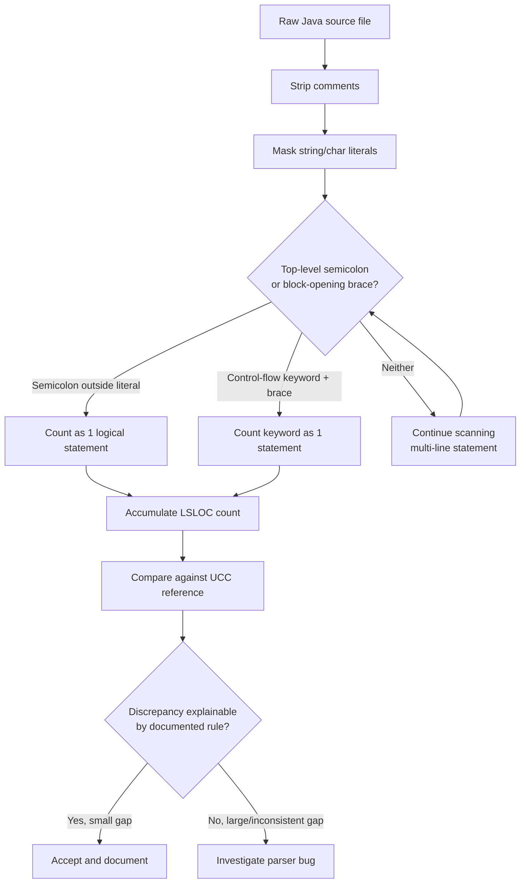

## Candidate Tools for Java SLOC Analysis

1. **cloc** — widely used, language-aware physical SLOC counter
2. **scc** (Sloc Cloc and Code) — fast, modern, similar approach to cloc with COCOMO estimates
3. **UCC (Unified CodeCount)** — purpose-built for both physical and logical SLOC, used in academic/COCOMO contexts
4. **Understand (SciTools)** — commercial static analysis tool with logical SLOC and complexity metrics
5. **Custom Java parser script** (using a library like JavaParser) — gives full control over LSLOC definition, reproducible if documented

A sixth category worth naming explicitly given the assignment's GAI requirement: an **LLM-assisted counting/validation pass** (e.g., using Claude or ChatGPT to review ambiguous statement boundaries, generate test snippets, or sanity-check a custom script's output against hand-counted samples). This satisfies "use of a GAI tool" without making the LLM the actual counting mechanism — LLMs are not reliable as a primary SLOC counter since they don't deterministically parse syntax trees, but they're useful as a second-opinion or documentation aid.

---

## Comparison Table

| Tool | Supports Java | Physical SLOC | Logical SLOC | Strengths | Weaknesses | Ease of Use |
|---|---|---|---|---|---|---|
| cloc | Yes | Yes (strong) | No | Fast, battle-tested, handles comments/blank lines well, huge language coverage | No real LSLOC concept, only physical lines minus comments/blanks | Very easy, single command |
| scc | Yes | Yes (strong) | Partial (counts complexity, not true LSLOC) | Very fast, gives complexity estimate alongside SLOC, clean output | "Complexity" metric is not the same as logical statement count | Very easy |
| UCC | Yes | Yes | Yes (designed for this) | Built specifically for physical vs logical SLOC distinction, used in COCOMO-style estimation, academically recognized | Older tool, less actively maintained, occasionally fiddly setup/install | Moderate — some setup required |
| Understand | Yes | Yes | Yes | Robust logical SLOC, full AST-based parsing, complexity metrics included | Commercial license cost, overkill for a small student project, steeper learning curve | Moderate to hard (license + GUI) |
| Custom JavaParser script | Yes | Yes (if implemented) | Yes (fully customizable) | Full transparency, scheme tailored to course definition, fully reproducible if documented | Requires implementation effort, risk of bugs/edge cases, needs validation against a reference | Hard initially, easy to rerun once built |

---

## Primary Reference Tool Recommendation

**UCC (Unified CodeCount)** is the recommended primary reference tool. It is one of the only freely available tools that draws an explicit, documented line between physical and logical SLOC rather than treating SLOC as a single physical-line count, which matters directly for this assignment's focus. It's also widely cited in software measurement coursework, so its definitions are easy to justify to a grader. The setup overhead is a real but acceptable cost for a one-time measurement task.

**cloc or scc** should be used as a secondary cross-check for physical SLOC only — they're fast, trustworthy for that narrower purpose, and useful to confirm UCC's physical-line counts aren't wildly off due to a misconfiguration.

---

## Is a Custom LSLOC Script Acceptable?

Yes, conditionally. A custom script is acceptable if:

- It is validated against UCC (or another established reference tool) on a representative sample, not just trusted blindly
- The counting rules are written down explicitly before coding the script, not inferred after the fact from whatever the script happens to do
- Edge cases (multi-line statements, ternaries, lambda expressions, try-with-resources) are tested individually with small synthetic examples
- The script's source is included in the deliverable so the count is reproducible by someone else

A custom script should **not** be presented as "exact" unless it has been checked against a reference on enough cases to support that claim. A pure regex-based script in particular should be treated as an approximation, since regex cannot reliably handle nested braces, multi-line strings, or generics without false positives/negatives — it's a reasonable starting point, not a ground truth.

---

## LSLOC Scheme Proposal

**Comment handling**
Strip all `//` line comments and `/* */` block comments before counting, including Javadoc (`/** */`). A line containing only a comment, even if "attached" visually to code, contributes 0 to LSLOC. A line with trailing code and a trailing comment counts only for the code portion.

**String/char literal handling**
Treat the contents of string and char literals as opaque — do not scan inside them for keywords, braces, or semicolons that would otherwise be mistaken for statement boundaries. This is the main reason a naive regex approach breaks: a string like `"if (x) { return; }"` must not be counted as control-flow or statement content.

**Statement boundaries**
A logical statement ends at a top-level semicolon `;` not enclosed in a string/char literal, or at a block-opening `{` that introduces a control structure (if/for/while/switch/try/catch/method body). Each such unit counts as one logical line, regardless of how many physical lines it spans.

**Control-flow keywords**
Each control-flow construct (`if`, `else if`, `else`, `for`, `while`, `do`, `switch`, `case`, `try`, `catch`, `finally`) counts as one logical statement at the point it's declared. The body of the block is counted separately, statement by statement. `case` labels in a `switch` each count individually.

**Compiler directives / imports / packages**
`package` and `import` declarations each count as one logical line. Annotations (`@Override`, `@SuppressWarnings`, etc.) are typically excluded from LSLOC since they're declarative metadata rather than executable/declarative program statements — but this is a judgment call; whichever choice is made should be documented and applied consistently.

**Data declarations vs executable instructions**
Field and local variable declarations count as one logical line each, even when declared on the same physical line (`int a, b, c;` counts as one logical statement per the standard SLOC convention, or as three if your scheme chooses to count per-variable — pick one and document it). Executable statements (assignments, method calls, return statements) each count as one logical line.

**Multi-line statements**
A statement spanning multiple physical lines (e.g., a chained method call or a long conditional broken across lines) counts as exactly one logical line. This is the core distinction from physical SLOC and the main source of divergence between cloc-style counts and UCC-style counts.

---

## Validation Strategy

**Comparing script output to a reference tool**
Run both UCC and the custom script on the same source tree and compare counts at the file level first, then narrow down to specific files with the largest discrepancies. Use a small set of hand-crafted test files (10–20 lines each) covering one construct at a time — a multi-line if, a chained call, a switch statement, a string containing braces — and verify the custom script's count matches a manually reasoned-through expected value before trusting it on the full codebase.

**Kinds of mismatches to investigate**
Discrepancies typically come from: multi-line statement collapsing (script counts each physical line, reference collapses to one), string literals containing code-like characters, multi-variable declarations on one line, lambda expressions and method references (Java 8+ constructs that older tools like UCC may not parse correctly), and annotation handling differences.

**When a gap is acceptable vs not**
A gap of a few percent (roughly under 5%) on a whole-file or whole-project comparison, traceable to a documented and consistent rule difference (e.g., "we count multi-variable declarations as one line, UCC counts them as N"), is acceptable and should simply be noted in the report. A gap is not acceptable if it's inconsistent across files (suggesting a parsing bug rather than a rule difference), or if it's large enough (double-digit percent) that it can't be explained by a specific, named rule choice — that indicates the script has an actual defect that needs fixing before the numbers are used for any size/complexity claims.

---

## Decision Rationale

UCC is appropriate as the primary reference because it's free, explicitly designed to separate physical from logical SLOC, and academically recognized, which matters for a measurement course where the grader will likely expect a defensible methodology rather than a black-box number. Pairing it with cloc/scc as a physical-SLOC cross-check is low-cost and catches gross errors. A custom script is worth building only if the team wants to deeply understand and control the LSLOC definition (which fits the spirit of a measurement course), but it must be validated against UCC rather than treated as authoritative on its own — that keeps the approach honest about the accuracy/effort tradeoff: UCC alone is faster and already trustworthy; a custom script gives more pedagogical insight and tailoring, at the cost of implementation and validation time the team has to budget for.

---

## LSLOC Decision Pipeline

