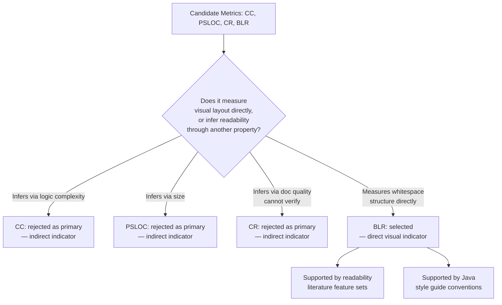

## What "Readability" Means Under These Constraints

In a study with no human raters, "readability" can't be defined as "what readers report finding easy to read" — that's the textbook definition (Buse & Weimer, and similar empirical readability work, define it that way), but it's not measurable here. Under these constraints, readability has to be redefined operationally as **a static, structural proxy for how visually and cognitively parseable the source code is**, based on layout and surface-level structure rather than semantic understanding. This is a narrower claim than "true" readability — the team should be explicit in their report that they are measuring a *correlate* of readability, not readability itself.

---

## Why the Absence of Human Experiments Changes the Strategy

Most readability research (e.g., Buse & Weimer's readability model) validates metrics against human judgments collected via surveys, then finds which static features correlate with those judgments. Without that validation step, the team cannot claim any metric "measures readability" in the same sense the literature does — instead, they need to pick the metric that requires the *fewest* unjustified assumptions to interpret as a readability proxy. This shifts the selection criterion from "which metric best predicts past human ratings" to "which metric most directly reflects a property humans have repeatedly identified as part of how code looks to a reader" (e.g., visual density, spacing, structure) without relying on a complexity or size proxy that's only indirectly related to visual readability.

---

## Candidate Metric Table

| Metric | What It Measures | Why It's Useful | Why It's Weak as a Primary Readability Metric |
|---|---|---|---|
| Cyclomatic Complexity (CC) | Number of independent paths through control flow | Well-established, easy to compute, correlates with comprehension difficulty in some studies | Measures *logical* complexity, not visual/textual readability — a high-CC method can still be cleanly formatted, and a low-CC method can still be a visually dense wall of text |
| Physical SLOC (PSLOC) | Raw line count | Trivial to compute, gives a size baseline | Size is not readability — a long well-formatted file can be easier to read than a short cramped one; PSLOC says nothing about layout |
| Comment Ratio (CR) | Proportion of comment lines to total lines | Comments are part of the readability literature's feature set, easy to compute | Comment quantity doesn't imply comment quality or placement; a high CR could mean useful documentation or could mean dead/commented-out code; doesn't directly reflect how the *code itself* reads |
| Blank Line Ratio (BLR) | Proportion of blank lines used for visual separation | Directly reflects whitespace structure, which readability literature explicitly identifies as a visual readability feature; purely structural, no semantic ambiguity | Doesn't capture naming quality, indentation consistency, or logical structure — it's one visual feature among several, not a complete model |

---

## Direct vs Indirect Readability Indicators

**Direct readability indicators** (relate to how the code visually presents itself to a reader, independent of what it computes): Blank Line Ratio, line length distribution, indentation consistency. These describe the *layout* a reader's eyes actually encounter.

**Indirect readability indicators** (relate to underlying logical or documentation properties that *may* correlate with perceived readability, but require an inferential step to connect to "readability"): Cyclomatic Complexity (infers that more branching paths are harder to follow), Physical SLOC (infers that longer code is harder to read), Comment Ratio (infers that more comments mean better-explained code).

CC and PSLOC are arguably better classified as **complexity/size metrics that correlate with readability** rather than readability metrics themselves — this distinction matters for the team's defense of their choice.

---

## Decision Section: Why BLR Is the Selected Metric

Blank Line Ratio is selected as the final metric because it is the only candidate in this set that measures a strictly visual/layout property without requiring an inferential leap through complexity or documentation quality. CC requires assuming "more branches = harder to read," which conflates logical and visual readability. PSLOC requires assuming "longer = harder to read," which ignores formatting entirely — a 200-line well-spaced file can be easier to read than a 100-line cramped one. CR requires assuming comment *quantity* reflects comment *usefulness*, which the metric cannot verify on its own (it can't distinguish a helpful comment from a stale one or commented-out code).

BLR, by contrast, measures something readability research has repeatedly identified as a structural readability feature — visual chunking/whitespace — without needing any assumption about what the blank lines are *for*. It is closer to a direct observation of layout than CC, PSLOC, or CR, each of which is one inferential step removed from anything visual.

This is a comparative claim, not an absolute one: BLR is not claimed to fully capture readability — no single static metric does — but among the four candidates it requires the least interpretive leap to justify as a readability proxy, which is the relevant criterion when no human validation step is available.

---

## Literature Support

Empirical readability research (most notably Buse and Weimer's work on automatically assessing code readability) builds predictive models from a *basket* of static features including line length, blank lines, indentation, and identifier characteristics, validated against human judgments. Blank lines and whitespace-related features appear consistently in that feature set as contributors to perceived readability. It's important not to overstate this: that research validates *combinations* of features against human raters, not blank lines in isolation — so the literature support for BLR specifically is suggestive, not a direct one-to-one validation. The team's report should frame this honestly as "BLR is one of the visual features known to contribute to readability models" rather than "BLR has been proven to equal readability."

## Style-Guide Support

Major style guides (Google Java Style Guide, Oracle's Java code conventions) explicitly recommend blank lines to separate logical sections of code — methods, blocks, related statement groups — as a readability practice. This gives BLR a normative basis distinct from the empirical literature: independent of any human study, the convention itself treats blank-line usage as a deliberate readability tool, which supports using its ratio as a proxy for whether a file follows commonly accepted visual-structuring practice.

---

## Slide-Friendly Summary

*Slide 1:* Without human readability experiments, we needed a metric that measures readability directly rather than inferring it from complexity or size. Cyclomatic Complexity and Physical SLOC are complexity/size metrics that only indirectly suggest readability; Comment Ratio depends on comment quality we can't verify automatically. Blank Line Ratio is the most direct of our candidates because it measures visual structure itself — the actual layout a reader encounters — without requiring an unverifiable assumption about logic or documentation.

*Slide 2:* Blank Line Ratio is supported both by readability literature, where whitespace features are part of established predictive models, and by major Java style guides, which explicitly recommend blank-line separation as a readability practice. We do not claim BLR alone fully captures readability — no static metric does — but among CC, PSLOC, CR, and BLR, it requires the fewest assumptions to interpret as a readability proxy, making it the most defensible choice for an automated, human-free evaluation.

---

## Selection Process Diagram

