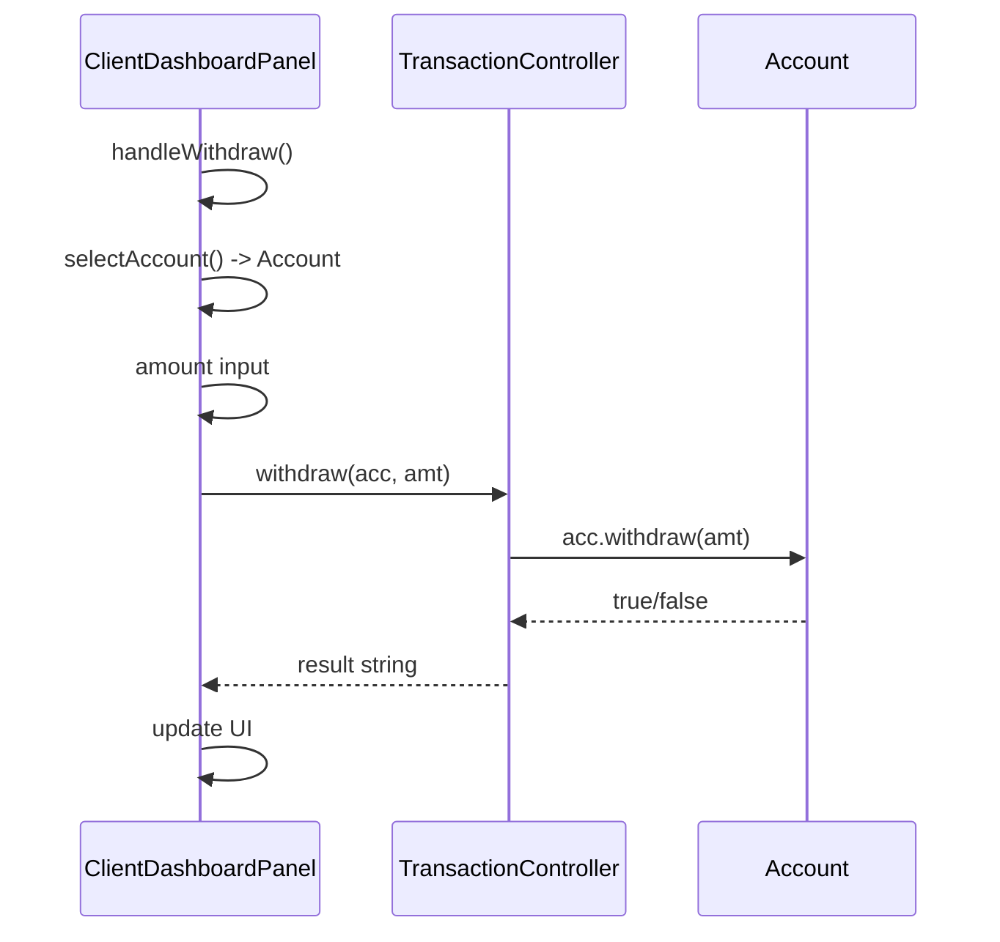
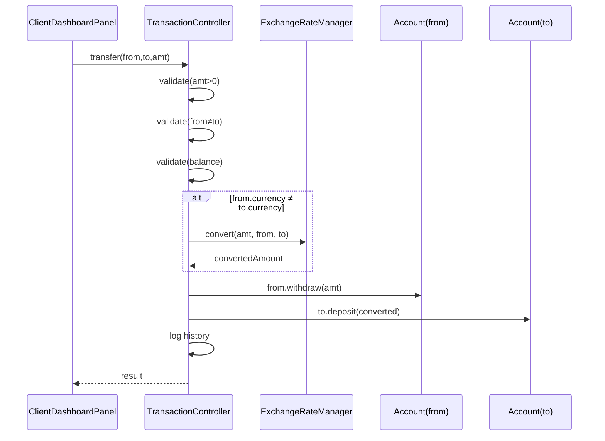

# iBank D2 Software Design Document

> **Course:** SOEN 6611 — Software Measurement  
> **Project:** iBank ABM Simulation  
> **Team:** Group C  
> **Date:** 2026-06-19  

---

## 1. Architecture Overview

The iBank application follows the **Model-View-Controller (MVC)** architectural pattern, implemented with **Java Swing** for the GUI layer. The architecture enforces strict separation of concerns:

- **Model** — domain data and business logic (no Swing dependencies)
- **View** — Java Swing GUI components (no direct model mutation)
- **Controller** — orchestrates model operations and mediates between view and model

```
┌──────────────────────┐
│       MainFrame      │  ← Application entry point, owns CardLayout
│   (View + Router)    │     navigation between panels
└─────────┬────────────┘
          │
    ┌─────┴──────┐
    │            │
    ▼            ▼
┌────────┐  ┌──────────┐
│  View  │  │Controller│
│ Panels │  │  Layer   │
└───┬────┘  └────┬─────┘
    │            │
    │     ┌──────┴──────┐
    │     │             │
    ▼     ▼             ▼
┌─────────────────────────┐
│      Model Layer         │
│  (User, Account, etc.)  │
└─────────────────────────┘
```

### MVC Responsibility Matrix

| Component | Reads Model | Mutates Model | Owns UI Code | Handles Events |
|-----------|:-----------:|:-------------:|:------------:|:--------------:|
| Models | Y | Y | N | N |
| Controllers | Y | Y (delegates) | N | N |
| Views | Y (read-only) | N | Y | Y (delegates) |

---

## 2. Package Structure

```
d2/src/
├── models/
│   ├── User.java                 (abstract base for actors)
│   ├── BankClient.java           (client with multi-currency accounts)
│   ├── SystemAdmin.java          (admin with unlock/rate privileges)
│   ├── Account.java              (balance, currency, account type)
│   ├── ExchangeRateManager.java  (singleton, currency conversion)
│   ├── DatabaseManager.java      (SQLite database interaction)
│   ├── CashBox.java              (singleton, tracks physical cash)
│   └── TransactionRecord.java    (data class for transactions)
├── controllers/
│   ├── AuthenticationController.java  (PIN validation, lockout logic, user DB)
│   ├── TransactionController.java     (withdraw, deposit, transfer, history)
│   └── I18nController.java           (singleton, locale string loading)
├── views/
│   ├── MainFrame.java            (JFrame root, CardLayout navigation)
│   ├── BaseViewPanel.java        (Abstract base class for all panels)
│   ├── LoginPanel.java           (card + PIN)
│   ├── ClientDashboardPanel.java (balances, transactions)
│   ├── AdminDashboardPanel.java  (exchange rates, user unlock)
│   ├── TechnicianPanel.java      (refill cash box)
│   ├── NumpadPanel.java          (Reusable numpad component)
│   ├── LanguageSelectorPanel.java(EN/FR/ZH toggle)
│   └── Router.java               (Interface for navigation)
├── exceptions/
│   ├── AccountLockedException.java
│   ├── InsufficientFundException.java
│   └── InvalidAmountException.java
└── resources/
    ├── messages_en.properties
    ├── messages_fr.properties
    └── messages_zh.properties
```

---

## 3. Model Layer Design

### 3.1 Class Hierarchy

```
User (abstract)
├── BankClient
│   └── owns List<Account>
├── SystemAdmin
└── Technician
```

### 3.2 Class Specifications

**`User`** (abstract)
| Field | Type | Description |
|-------|------|-------------|
| cardNumber | String | Unique identifier (simulated card) |
| pin | String | Plaintext PIN for simulation |
| userName | String | Display name |
| locked | boolean | Lockout state (Clients only) |
| failedAttempts | int | Consecutive wrong PIN counter |

| Method | Description |
|--------|-------------|
| authenticate(pin) | Returns true if PIN matches; increments counter; auto-locks Clients after 3 failures |
| unlock() | Resets locked flag and failedAttempts |
| canBeLocked() | Returns true for Clients, false for Admins/Technicians |
| getRole() | Abstract; returns "BankClient", "SystemAdmin", or "Technician" |

**`BankClient`** (extends User)
- Contains `List<Account>` — supports multiple accounts in different currencies
- Methods: `addAccount()`, `getAccounts()`, `findAccount(num)`

**`SystemAdmin`** (extends User)
- `unlockUser(User)` — resets any user's lockout state
- No accounts; purely administrative

**`Technician`** (extends User)
- No accounts; responsible for refilling the ABM cash box.

**`Account`**
| Field | Type | Description |
|-------|------|-------------|
| accountNumber | String | Unique account ID |
| balance | double | Current balance |
| currency | String | One of: CAD, USD, EUR |
| accountType | String | "chequing" or "savings" |

| Method | Description |
|--------|-------------|
| withdraw(amount) | Deducts amount; returns false if insufficient |
| deposit(amount) | Adds positive amount only |

**`ExchangeRateManager`** (Singleton)
- Internal `Map<String, Double>` rates (key format: `"CAD:USD"`)
- `getRate(from, to)` — returns conversion rate; auto-computes reciprocal from stored pairs
- `convert(amount, from, to)` — applies rate to amount
- setRate(from, to, rate) — admin updates a rate pair
- Default rates: CAD:USD=0.73, CAD:EUR=0.68, EUR:USD=1.08

**`DatabaseManager`** (Singleton)
- Connects to SQLite database `ibank.db`
- Handles querying and persisting users, accounts, rates, and transaction history.
- Hashes PINs using SHA-256 for secure verification.

**`CashBox`** (Singleton)
- Tracks physical ABM cash levels (max 50,000).
- `dispense(amount)` deducts from physical cash during withdrawals.
- `refill()` called by Technician to restore cash levels.

---

## 4. Controller Layer Design

### 4.1 AuthenticationController

**Responsibility:** User credential validation, session management, user database.

```
authenticate(cardNumber, pin)
    ├── Lookup user in HashMap<String, User>
    ├── Check locked status → throw AccountLockedException
    ├── Call user.authenticate(pin)
    │   ├── Success → set currentUser, return user
    │   └── Failure → return null (locked check happens on next call)
    └── logout() → clear currentUser
```

**Sample Data (hardcoded for prototype):**
| Card# | PIN | User | Type | Accounts |
|-------|-----|------|------|----------|
| 10001 | 1234 | Alice | Client | CAD chequing (1500), CAD savings (8500), USD chequing (2000), EUR savings (1500) |
| 10002 | 5678 | Bob | Client | CAD chequing (3200), CAD savings (10000), USD chequing (500) |
| 99999 | 0000 | Admin | Admin | (none) |

### 4.2 TransactionController

**Responsibility:** All monetary operations with validation and history logging.

| Operation | Validation | Cross-Currency |
|-----------|-----------|:--------------:|
| withdraw(acc, amt) | amt > 0, amt ≤ balance, multiples of $20, max $500/txn, max $2000/day, CAD only, ABM has cash | — |
| deposit(acc, amt) | amt > 0, multiples of $20, max $2000/txn, max $5000/day, CAD only | — |
| transfer(from, to, amt) | amt > 0, from ≠ to, amt ≤ from.balance | Y (auto-convert) |

- Cross-currency transfers: if `from.currency ≠ to.currency`, calls `ExchangeRateManager.convert()`
- All successful operations are logged to the database via `DatabaseManager.saveTransaction()`

### 4.3 I18nController (Singleton)

**Responsibility:** Dynamic UI language switching without application restart.

- Loads `.properties` files via classpath → filesystem fallback
- Maintains `List<I18nListener>` — panels register to receive `onLanguageChanged()` callbacks
- `setLanguage(lang)` → reload properties → notify all listeners
- Supported: `en`, `fr`, `zh`

---

## 5. View Layer Design

### 5.1 Navigation Flow

```
                 ┌──────────────┐
    App Start ──▶│  LoginPanel  │◀──────────────┐
                 └──┬───────┬───┘               │
                    │       │                   │
         BankClient │       │ SystemAdmin       │ logout
                    ▼       ▼                   │
         ┌────────────┐ ┌────────────────┐      │
         │ ClientDash │ │ AdminDashboard │──────┤
         └────────────┘ └────────────────┘      │
                                                │
                 ┌─────────────────┐            │
                 │ TechnicianPanel │────────────┘
                 └─────────────────┘

`MainFrame` uses `CardLayout` with four main cards: `"login"`, `"client"`, `"admin"`, `"tech"`, plus a `"language"` selector overlay.

### 5.2 LoginPanel

- Card number entry (JTextField)
- PIN entry via **on-screen numpad** (0-9, Clear, Delete) — simulates ABM keypad
- PIN displayed as masked password field (non-editable, focus disabled)
- Language toggle bar (shared via `LanguagePanel` in MainFrame's NORTH)

### 5.3 ClientDashboardPanel

- **Account Table:** JTable showing account#, type, balance+currency, currency
- **Action Buttons:** Withdraw, Deposit, Transfer, Balance Inquiry, Transaction History, Logout
- **Output Area:** JTextArea showing last operation result or transaction history

Transaction dialogs use `JOptionPane.showInputDialog` for amount entry and `JOptionPane.showInputDialog` with dropdown for account selection.

### 5.4 AdminDashboardPanel

Split into two sections (GridLayout 1×2):

**Left — Exchange Rates:**
- JTable showing configured currency pairs and rates
- "Update Rate" button opens input dialog for selected pair

**Right — User Management:**
- JTable listing all BankClient users (card#, name, Locked/Active status)
- "Unlock User" button unlocks the selected locked user

### 5.5 LanguagePanel

- Horizontal bar with EN/FR/ZH toggle buttons
- Disabled button = current language
- Calls `I18nController.setLanguage()` on click
- Registered as I18nListener to update button states on language change

---

## 6. Exception Handling Strategy

| Exception | Thrown When | Caught By |
|-----------|------------|-----------|
| `AccountLockedException` | PIN attempts exhausted | `MainFrame.authenticateAndNavigate()` → shows error on LoginPanel |
| `InsufficientFundException` | Withdraw/transfer exceeds balance | `ClientDashboardPanel` → shows error in output area |
| `InvalidAmountException` | Amount ≤ 0 or same-account transfer | `ClientDashboardPanel` → shows error in output area |

- All exceptions carry descriptive messages visible to the user
- `InsufficientFundException` additionally carries `available` and `requested` amounts for potential future use

---

## 7. Key Design Decisions

### 7.1 Single-User, Single-Session
The prototype is single-user. No concurrency handling is implemented. The `AuthenticationController.currentUser` field holds the sole active session.

### 7.2 SQLite Data Persistence
All data (users, accounts, balances, transaction history, exchange rates) is persisted to a local SQLite database (`ibank.db`) using `DatabaseManager.java`. The system schemas are auto-generated on the first run.

### 7.3 Singleton Controllers
`ExchangeRateManager` and `I18nController` use the Singleton pattern because:
- Exchange rates must be globally consistent
- Language state must be globally consistent across all panels

Both provide `resetInstance()` for testability.

### 7.4 Observer Pattern for I18n
Views implement `I18nController.I18nListener` and register with the controller. On language change, the controller notifies all registered listeners, which call their `updateTexts()` method to refresh UI strings.

### 7.5 Cryptographic PIN Hashing
PINs are hashed using the SHA-256 algorithm via `DatabaseManager.hash()`. The plaintext PIN is never stored, significantly enhancing security beyond the initial prototype limitations.

### 7.6 No Package Declaration
All classes are in the default (unnamed) package. This simplifies compilation for a small project. Import statements reference classes directly without package prefixes.

---

## 8. Data Flow: Key Use Cases

### 8.1 Withdraw (single currency)


### 8.2 Cross-Currency Transfer


---

## 9. Compilation & Execution

```bash
# Compile (from project root)
mkdir -p d2/bin
javac -d d2/bin -sourcepath d2/src \
  d2/src/models/*.java \
  d2/src/exceptions/*.java \
  d2/src/controllers/*.java \
  d2/src/views/*.java

# Run (from project root)
java -cp d2/bin:d2/src views.MainFrame
```

The `-cp d2/bin:d2/src` classpath includes `d2/src` so that `resources/` is on the classpath for I18nController to load `.properties` files via `ClassLoader.getResourceAsStream()`.

---

## 10. Alignment with D2 Requirements

| D2 Requirement | How Addressed |
|---------------|---------------|
| Java Swing GUI | All views extend `JPanel`; `MainFrame` extends `JFrame` |
| MVC Architecture | Strict separation: models/, views/, controllers/ |
| Exception Handling | 3 custom exceptions with try-catch in all transaction paths |
| Multi-Currency | Account.currency field; ExchangeRateManager singleton |
| System Admin | SystemAdmin class; AdminDashboardPanel with rate/user management |
| Multilingual I18n | I18nController + 3 properties files + dynamic switching |
| OOP Paradigm | Inheritance (User hierarchy), encapsulation (private fields), polymorphism (getRole()) |
| SLOC/Readability Ready | Methods under 30 logical SLOC; meaningful identifiers; no dead code |

---

## 11. Future Considerations (D3)

The code structure supports the following D3 metrics:

| Metric | Supported By |
|--------|-------------|
| Logical SLOC | Every class and method is countable |
| Cyclomatic Complexity | Branching in `authenticate()`, `withdraw()`, `transfer()`, input validation |
| WMC | Sum of method complexity per class (User, TransactionController, etc.) |
| LCOM* | Classes have fields + methods that access them (Account, User, etc.) |
| Coupling Factor | ClientDashboardPanel → TransactionController → ExchangeRateManager → Account chains |
| Use Case Points | 5 client use cases + admin use cases with 2 actor types |

---

*End of Software Design Document*
